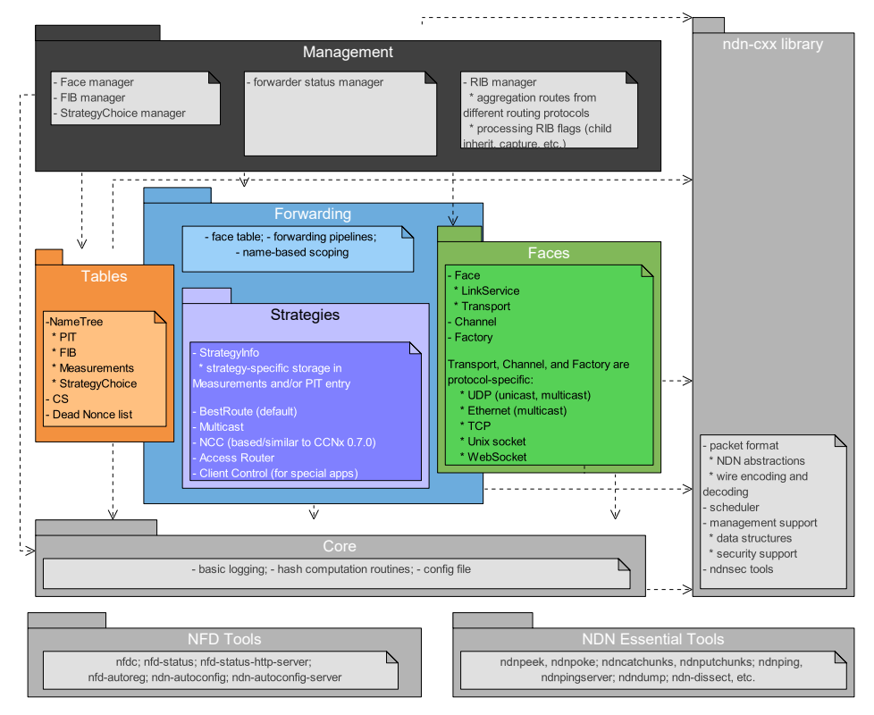

NDN转发守护程序（ *NFD* ）是一个网络转发器，它与命名数据网络（ *NDN* ）协议 [1] 一起实现和发展。 本文档介绍了NFD的内部结构，并且适合有兴趣扩展和改进NFD的开发人员。 有关NFD的其他信息，包括有关如何编译和运行NFD的说明，可在NFD主页上找到 [2] 。

**NFD的主要设计目标是支持NDN体系结构的各种实验**。 该设计强调 `模块化` （ *modularity* ） 和 `可扩展性` （ *extensibility* ），以便使用新协议功能，算法和应用程序进行实验。 我们尚未完全优化代码以提高性能，目的是性能优化是开发人员可以通过尝试不同的数据结构和不同的算法来进行的一种实验。随着时间的流逝，在相同的设计框架内可能会出现更好的实现。

NFD将在三个方面不断发展： **改进模块化框架** ， **符合NDN协议规范** 以及 **添加新功能** 。 我们希望保持模块化框架的稳定和精益，使研究人员能够实施和试验各种功能，其中某些功能最终可能会成为协议规范。

### 1.1 NFD模块

**NFD的主要功能是转发兴趣（ *Interest packet* ）和数据包（ *Data packet* ）** 。为了实现这个目的，它将底层的网络传输机制抽象到 *NDN Faces* 中，并维护诸如 *CS* 、 *PIT* 和 *FIB* 之类的基本数据结构，并实现数据包（ *packet* ）处理逻辑。 除了基本的数据包转发外，它还支持多种转发策略以及一个用于配置，控制和监视NFD的管理接口。 如下图1所示，NFD包含以下相互依赖的模块：

图1  NFD模块概览图

- **ndn-cxx Library, Core, and Tools** （第10节）

  这些库提供不同NFD模块之间共享的各种通用服务。 其中包括哈希计算例程，DNS解析器，配置文件， *Face* 监控和其他几个模块。

- **Faces**（第2节）

  在各种较低级别的传输机制之上实现 *NDN Face* 抽象。

- **Tables**（第3节）

  实现内容存储（ *CS*, Content Store ）、待定兴趣表（ *PIT*, Pending Interest Table ）、转发信息库（ *FIB*, Forwarding Information Base ）、策略选择（ *Strategy Choice* ）、测量（*Measurements*）和其他数据结构，以支持NDN数据包和兴趣包的转发。

- **Forwarding**（第4节）

  实现基本的数据包（ *packet* ）处理路径（ *processing pathways* ），该路径与 *Faces*、*Tables* 和 *Strategies* 模块交互（第5节）。策略是转发模块的主要部分，转发模块以转发管道的形式实现了一个框架，以支持不同的转发策略，有关详细信息，请参见第4节。

- **Management**（第6节）

  实现NFD管理协议 [3] ，该协议允许应用程序配置NFD并设置/查询NFD的内部状态。 协议交互是通过NDN在应用程序和NFD之间进行的兴趣/数据交换来完成的。

- **RIB Management**（第7节）

  本模块负责管理路由信息库（ *RIB*, Routing Information Base ）。  *RIB* 可以由不同方以不同方式进行更新，包括各种路由协议，应用程序前缀注册以及 *sysadmins* 进行的命令行操作。  *RIB* 管理模块处理所有这些请求以生成一致的转发表，并将其与NFD的FIB同步，该FIB仅包含转发决策所需的最少信息。

本文档的剩下部分将更详尽地描述所有这些模块。

### 1.2 在NFD中是如何处理数据包（ *packet* ）的

为了使读者更好地了解NFD的工作原理，本节介绍了如何在NFD中处理数据包。

数据包通过 *Faces* 到达NFD。 ***Face* 是广义的接口（ *Interface* ）**：

- 它可以是物理接口（ *physical interface* ）——NDN直接在以太网之上运行；
- 也可以是覆盖隧道（ *overlay tunnel* ）——NDN作为TCP，UDP或WebSocket之上的覆盖；
- 另外，NFD和本地应用程序之间的通信可以通过也是Face的Unix域套接字来完成。

*Face* 由 *LinkService* 和 *Transport* 组成。  *LinkService* 为 *Face* 提供高级服务，例如分片和重组，网络层计数器和故障检测，而Transport充当基础网络传输协议（TCP，UDP，以太网等）的包装，并提供链路层计数器之类的服务。Face通过操作系统API读取传入的流或数据报，从链路协议数据包中提取网络层数据包，并将这些网络层数据包（NDN数据包格式Interests，Datas或Nacks）传递给转发（ *Forwarding* ）模块。

网络层数据包（Interest，Data或Nack）由转发管道（ *forwarding pipelines* ）处理，转发管道定义了对数据包进行的一系列操作步骤。NFD的数据平面是有状态的，NFD对数据包的处理方式不仅取决于数据包本身，还取决于存储在表中的转发状态。

当转发器（ *Forwarder* ）接收到兴趣包（ *Interest packet* ）时，首先将其插入到兴趣表（ *PIT*， Pending Interest Table ）中，其中每个条目代表未决兴趣或最近满足的兴趣。在内容存储库（CS）上执行匹配数据的查找，内容存储库是数据包的网络内缓存。如果CS中有匹配的数据包，则将该数据包返回给请求者。 否则，该兴趣包需要被转发。

转发策略（ *forwarding strategy* ）决定了如何转发兴趣包。NFD允许按名称空间选择转发策略，它在包含策略配置的“策略选择”表上执行最长的前缀匹配查找，来确定使用哪个策略来转发兴趣包。转发策略将决定是否，何时以及在何处转发兴趣包（或更准确地说是PIT条目）。在使用某个策略作转发时，策略模块：

- 可以从转发信息库（FIB）中获取输入，该信息库包含来自本地应用程序的前缀注册和路由协议的路由信息；
- 还可以使用存储在PIT条目中的特定的策略信息；
- 也可以记录和使用存储在 *Measurements* 表项中的数据面的性能测量结果。

在策略模块决定将兴趣包转发到指定的 *Face* 后，该兴趣包将在转发管道（ *forwarding pipelines* ）中经过更多步骤，然后将其传递给 *Face* 。 *Face* 根据基础协议，在必要时将兴趣包分片，将网络层数据包封装在一个或多个链路层数据包中，然后通过操作系统 APIs 将链路层数据包作为输出流或数据报发送。

NFD对一个数据包（ *Data packet* ）到来的处理方式有所不同。它的第一步是检查兴趣表（PIT），以查看是否有此数据包可以满足的PIT条目，然后选择所有匹配的条目以进行进一步处理。 如果此数据包（ *Data packet* ）不能满足任何PIT条目，则它是未经请求的（ *unsolicited* ）并且将被丢弃。 否则，数据将添加到内容存储（ *CS* ）中，接着通知负责每个匹配的PIT条目的转发策略。通过此通知，以及另一个“无数据返回”超时，该策略能够观察路径的可访问性和性能。该策略可以在 *Measurements* 表中记住其观察结果，以改进其将来的决策。最后，将数据包（ *Data packet* ）发送给所有匹配的记录在PIT条目的下游记录中的请求者。通过 *Face* 发送数据包（ *Data packet* ）的过程类似于发送兴趣包（ *Interest packet* ）。

当转发器收到Nack时，处理过程将根据使用的转发策略（ *forwarding strategy* ）而有所不同。

### 1.3 NFD如何处理管理兴趣（ *Management Interests* ）

NFD管理协议（ *Management protocol* ） [3] 定义了三种基于兴趣包数据包交换的进程间管理机制：**`控制命令`**（ *control commands* ），**`状态数据集`**（ *status datasets* ）和**`通知流`**（ *notification streams* ）。 本节简要概述了这些机制的工作方式以及它们的要求。

**`控制命令`** （ *control commands* ）是已签名（已认证）的兴趣包，用于在NFD中执行状态更改。由于每个控制命令兴趣包的目标都是到达目的管理模块，而不是被内容缓存（CS）所满足，因此，通过使用时间戳（ *timestamp* ）和随机数（ *nonce* ）组件，可以使每个控制命令兴趣变得唯一。 有关更多详细信息，请参见控制命令规范 [4]。

NFD收到控制命令请求后，会将请求定向到一个被称为“内部 *Face* ”（ *Internal Face* ）的特殊 *Face* 。当请求转发到此Face时，它会在内部分配给指定的管理员（ *manager* ）。例如，以`/localhost/nfd/faces` 作为前缀的兴趣包会分配给Face管理员，请参见第6节。然后，管理员查看请求名称，以确定请求哪个操作。如果名称表示有效的控制命令，则调度程序（ *dispatcher* ）将验证命令（检查签名并验证请求者是否有权发送此命令），如果验证成功，则管理器将执行请求的操作。响应以数据包的形式发送回请求者，该数据包由转发和Face处理，其处理方式与常规数据相同。

> *Internal Face* ：在FIB中始终有一个FIB条目匹配管理协议前缀，并指向 *Internal Face* （ *There is always a FIB entry for the management protocol prefix that points to the Internal Face.* ）

上述过程的一个例外是RIB管理（第7节），它是在单独的线程中执行的。 使用与转发到任何本地应用程序相同的方法，将所有RIB管理控制命令转发给RIB线程而不是 *Internal Face* （RIB线程在启动时会使用NFD为RIB管理前缀“注册”自身）。

**`状态数据集`** （ *status dataset* ）是包含定期或按需生成的NFD内部状态的数据集（例如NFD常规状态或NFD Face状态）。任何人都可以使用规范 [3] 中定义的针对特定管理模块的简单的没有签名的兴趣包（ *unsigned Interest* ）来请求这些数据集。请求状态数据集新版本的兴趣将转发到内部Face，然后以与控制命令相同的方式转发到指定的管理器。但是，管理器不会验证此兴趣，而是会生成请求数据集的所有的段（ *segments* ）并将其放入转发管道中。这样，数据集的第一部分将直接满足初始兴趣，而其他部分将通过CS满足后续兴趣。在不太可能发生的情况下，如果后续段在被提取之前已从CS中驱逐，则请求者负责从头开始重新启动提取过程。

**`通知流`** （ *notification streams* ）与状态数据集相似，因为任何人都可以使用未签名的兴趣来访问它们，但是操作方式不同。想要接收通知流的订户（ *Subscribers* ）仍将兴趣发送到指定的管理员。但是，这些利益将由调度员丢弃，并且不会转发给管理者。相反，无论何时生成通知，管理器都会将数据包放入转发中，以满足所有未完成的通知流的兴趣，然后将通知传递给所有订户。 预计这些兴趣将不会立即得到满足，并且订阅者将在到期时重新表达通知流兴趣。