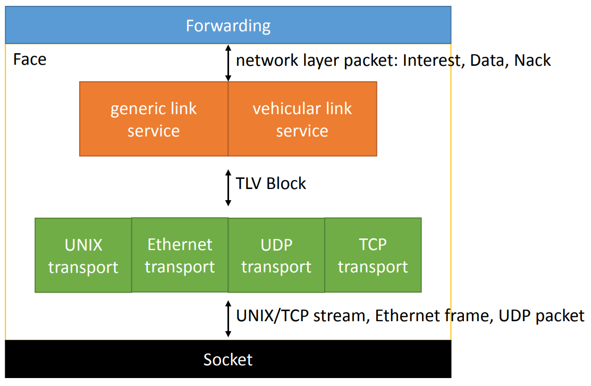
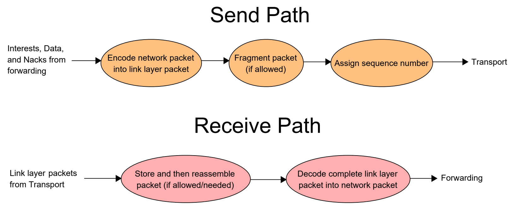
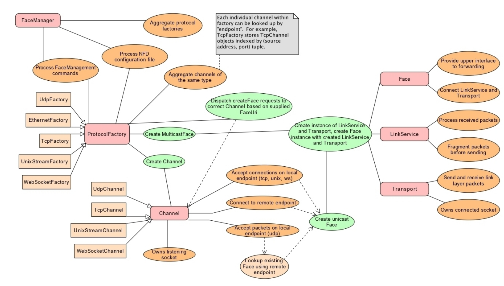

*Face* 是广义的网络接口。与物理网络接口类似，可以在 *Face* 上发送和接收数据包。*Face* 比网络接口更通用。 它可能是：

- 物理网络接口以在物理链路上进行通信（ *a physical network interface to communicate on a physical link* ）；
- NFD与远程节点之间的覆盖通信通道（ *an overlay communication channel between NFD and a remote node* ）；
- NFD与本地应用程序之间的进程间通信通道（ *an inter-process communication channel between NFD and a local application* ）。

*Face* 为NDN网络层数据包提供尽力而为的传递服务。 *Forwarding* 可以通过 *Face* 发送和接收兴趣包（ *Interest packet* ），数据包（ *Data packet* ）和 Nack。 然后，该 *Face* 处理低层的通信机制（例如套接字），并对 *Forwarding* 隐藏不同底层协议的差异和细节。

第2.1节介绍了 *Face* 的语义，转发方式以及它的内部结构包括 *Transport* （第2.2节）和 *LinkService* （第2.3节）。 2.4节介绍了 *Face* 的创建和组织方式。2.6节介绍了NDN的链路协议（`NDNLPv2`, *NDN Link Protocol* ），它是一种在 *Face* 系统中实现的链路自适应协议（ *link adaptation protocol* ）。

### 2.1 Face

NFD作为网络转发器，在网络接口之间移动数据包。NFD不仅可以在物理网络接口上进行通信，还可以在各种其他通信通道上进行通信，例如TCP和UDP上的覆盖隧道。因此，我们将“网络接口”泛化为“Face”，从而抽象了NFD可用于数据包转发的通信通道。*Face* 抽象（nfd :: Face类）为NDN网络层数据包提供尽力而为的传递服务。*Forwarding* 可以通过 *Face* 发送和接收兴趣包（ *Interest packet* ），数据包（ *Data packet* ）和 Nack。 然后，该 *Face* 处理低层的通信机制（例如套接字），并对 *Forwarding* 隐藏不同底层协议的差异和细节。

在NFD中，NFD与本地应用程序之间的进程间通信通道也被视为 *Face* 。 这不同于传统的 TCP/IP 网络栈，在传统的 TCP/IP 网络栈中，本地应用程序使用syscall与网络栈进行交互，而网络数据包仅存在于线路上。NFD能够通过 *Face* 与本地应用程序进行通信，因为网络层的数据包格式与线路上的数据包相同。对本地应用程序和远程主机使用统一的 *Face* 抽象可以简化NFD体系结构。

**Forwarding 如何使用 Face的？** `FaceTable` 类是 *Forwarding* 的一部分，它跟踪所有活动的 *Face* 。 新创建的 *Face* 将传递给 `FaceTable::add`，这个函数为传入的 *Face* 分配一个数字 *FaceId* 用于识别。 关闭 *Face* 后，将其从 *FaceTable* 中删除。*Forwarding* 通过连接到`afterReceiveInterest`、`afterReceiveData`和`afterReceiveNack`信号来从 *Face* 接收数据包，此操作在 *FaceTable* 中完成。 *Forwarding* 可以通过调用`sendInterest`、`sendData`和`sendNack`方法来通过 *Face* 发送网络层数据包。

**Face 的属性** => *Face* 公开了一些属性以显示其状态并控制其行为：

- **`FaceId`** 是一个数字ID，用于区分不同的 *Face* ，*FaceTable* 为它分配了一个非零值，并且当从 *FaceTable* 中删除 *Face* 时将其清除；
- **`LocalUri`** 是一个 `FaceUri`（第2.2节），代表本地端点（ *endpoint* ），该属性是只读的；
- **`RemoteUri`** 是一个`FaceUri`（第2.2节），代表远程端点，该属性是只读的；
- **`Scope`** 指示 *Face* 是否出于范围控制目的而位于本地，它可以是非本地的（ *non-local* ）或本地的（ *local* ），该属性是只读的；
- **`Persistency`** 控制当基础通信通道中发生错误或 *Face* 闲置了一段时间后系统的行为：
  - `on-demand`：设置为 *on-demand* 的 *Face* 保持空闲一段时间或在基础通信通道中发生错误，则它会关闭；
  - `persistent`：设置为 *persistent* 的 *Face* 会一直保持打开状态，直到被明确销毁，或者基础通信渠道发生错误；
  - `permanent`：设置为 *permanent* 的 *Face* 会一直保持打开状态，直到被明确销毁为止； 基础通信通道中的错误在内部得以恢复。
- **`LinkType`** 指示通信链接的类型，它可以是点对点（ *point-to-point* ）、多路访问（ *multi-access* ）或自组织网（ *ad hoc* ），该属性是只读的；
- **`State`** 指示 *Face* 的当前可用性：
  - *`UP`* ：*Face* 正常工作
  - *`DOWN`* ：*Face* 暂时处于 *down* 的状态，正在恢复，可以发送数据包，但是不太可能发送成功
  - *`CLOSING`* ：*Face* 正在关闭
  - *`FAILED`* ：*Face* 由于发生错误而关闭
  - *`CLOSED`* ：*Face* 已经关闭
- **`Counters`** 提供有关在 *Face* 上发送和接收的兴趣包、数据包、Nack的以及较低层数据包的数量和大小的统计信息。

图2  Face = LinkService + Transport

**内部结构（ *Internal structure* ）** ：在内部，*Face* 由 *LinkService* 和 *Transport* 组成（图2）。*Transport* （第2.2节）是 *Face* 较底层的部分，包裹了底层的通信机制（例如套接字或libpcap句柄），并为 *Face* 提供尽力而为的TLV数据包传递服务。*LinkService* （第2.3节）是 *Face* 较上层的部分，它在网络层数据包和较低层数据包之间进行转换，并提供其他服务，例如分片、链路故障检测和重传。*LinkService* 包含一个分片器（ *fragmentation* ）和一个重组器（ *reassembly* ），以允许它执行分片和重组。

*Face* 被实现为`nfd::face::Face` 类。 Face类被设计为不可继承的（单元测试除外），并且传递给其构造函数的 *LinkService*  和 *Transport* 完全定义了其行为。在构造函数中， *LinkService*  和 *Transport* 都被赋予了指向彼此和指向 *Face* 的指针，因此它们可以以最低的运行时开销相互调用。

接收和发送的数据包在传递到 *forwarding* 或在链路上发送之前分别通过 *LinkService*  和 *Transport* 。 *Transport* 收到数据包后，将通过调用`LinkService::receivePacket`函数将其传递到 *LinkService* 。当通过 *Face* 发送数据包时，它首先通过特定于数据包类型的函数（`Face::sendInterest`、`Face::sendData`或`Face::sendNack`）传递给 *LinkService* 。处理完数据包后，将通过调用`Transport::send`函数将其传递，或者如果已分片，则将其碎片传递到 *Transport* 。在 *LinkService* 和 *Transport* 中，使用远程端点ID（`Transport::EndpointId`）标识远程端点，该ID是64位无符号整数，其中包含每个远程主机的协议特定的唯一标识符。

### 2.2 Transport

**Transport**（基类为`nfd::face::Transport`）为 *Face* 的 LinkService 提供尽力而为的数据包传递服务。*LinkService* 可以调用`Transport::send`发送数据包。数据包到达时，将调用`LinkService::receivePacket`。 **每个数据包必须是完整的TLV块** ； 传输不对此块的TLV-TYPE进行任何假设。 另外，每个接收到的数据包都附带一个EndpointId，该EndpointId指示此数据包的发送方，这对于片段重组，故障检测以及多路访问链路上的其他目的很有用。

**Transport 属性** ：*Transport* 提供`LocalUri`、`RemoteUri`、`Scope` 、`Persistency`、`LinkType`和`State`属性，它还在输入和输出方向上维护较低层的数据包计数器和字节计数器。 这些属性和计数器可以通过 *Face* 访问。

如果将 *Transport* 的 `persistency` 属性设置为 *permanent* ，则 *Transport* 将负责采取必要的操作以从潜在故障中恢复。例如：UDP传输应忽略套接字错误。如果先前的连接已关闭，则TCP传输应尝试重新建立TCP连接。这种恢复的进度反映在 `State` 属性中。

此外，传输提供了以下属性供 *link service* 使用：

- **`Mtu`** 指示可以通过此传输发送或接收的最大数据包大小。它可以是正数，也可以是特殊的值 `MTU UNLIMITED`，表示对数据包大小没有限制。该属性是只读的。*Transport* 可以随时更改此属性的值，并且 *link service* 应为此做好准备。

**FaceUri** ：`FaceUri` 是一个URI，代表传输所使用的端点或通信通道。它以一个指示基础协议（例如udp4）的 *scheme* 开头，然后是基础地址的 *scheme* 特定表示。在`LocalUri`和`RemoteUri`属性中使用。

本节的其余部分描述了用于不同基础通信机制的每个单独传输，包括其`FaceUri`格式，实现细节和功能限制。

#### 2.2.1 Internal Transport

内部传输（`nfd::face::InternalForwarderTransport`）是与内部客户端传输（`nfd::face::InternalClientTransport`）配对的传输。 在内部转发器传输上传输的数据包在配对的客户端传输上被接收，反之亦然。 这主要用于与NFD *management* 进行通信； 这也用于实现TopologyTester（第11.1.3节）以进行单元测试。

#### 2.2.2 Unix Stream Transport

*Unix stream transport*（`nfd::face::UnixStreamTransport`）是一种在面向流的Unix域套接字上进行通信的传输。

> `Unix domain socket` 是是基于`Socket API`的基础上发展而来的，`Socket API`原本适用于不同机器上进程间的通讯，当然也可用于同一机器上不同进程的通讯（通过localhost），后来在此基础上，发展出专门用于进程间通讯的IPC机制，UDS与原来的网络Socket相比，仅仅只需要在进程间复制数据，无需处理协议、计算校验和、维护序号、添加和删除网络报头、发送确认报文，因此更高效，速度更快。UDS提供了和TCP/UDP类似的流和数据包，但这两种都是可靠的，消息不会丢失也不会乱序。 => 参考：[Unix domain socket(UDS)](https://www.jianshu.com/p/dc78b7ca006a)

NFD在指定的套接字上通过`UnixStreamChannel`监听传入的连接，该套接字的路径由`face_system.unix.path`配置选项指定。为每个传入连接创建一个UnixStreamTransport。NFD不支持建立传出Unix流连接。

Unix流传输的静态属性有：

- **`LocalUri`** ：`unix://path `，其中 *path* 为socket文件的路径，例如：`unix:///var/run/nfd.sock`
- **`RemoteUri`** ：`fd://file-descriptor`，其中 *file-descriptor* 是NFD进程中 *accepted socket* 的文件描述符
- **`Scope`** ：*local*
- **`Persistency`** ：固定为 *on-demand* ，不允许配置为其它值
- **`LinkType`** ： *point-to-point*
- **`Mtu`** ：*unlimited* （ *for all relevant face commands, NFD returns actual MTU* ）

`UnixStreamTransport`派生自`StreamTransport`，该 *Transport* 用于所有基于流的传输，包括Unix流和TCP。 `UnixStreamTransport`的大多数功能由`StreamTransport`处理。这样，当`UnixStreamTransport`收到超过最大包大小或无效的包时，传输进入失败状态并关闭。

接收到的数据存储在缓冲区中，当前缓冲区中的数据量也已存储。每次接收时，传输都会处理缓冲区中的所有有效数据包（ *packet* ）。 然后，该 *UnixStreamTransport* 将任何剩余的八位位组（ *[octets](https://baike.baidu.com/item/%E5%85%AB%E6%AF%94%E7%89%B9%E7%BB%84/5920941?fr=aladdin)* ）复制到缓冲区的开头，并等待更多的八位位组，将新的八位位组追加到现有八位位组的末尾。

#### 2.2.3 以太网单播传输（Ethernet Unicast Transport）

*Ethernet Unicast Transport*（`nfd::face::UnicastEthernetTransport`）是直接在以太网上进行通信的传输。

**NFD使用`EthernetChannel`在每个以太网兼容（ *Ethernet-compatible* ）的物理接口上监听到来的以太网帧** （其中不包括：回环接口- *loopback interface* 、点对点链路- *point-to-point links* 和GRE隧道- *GRE tunnels* ）。NFD将会为每个远程端点（ *remote endpoint* ）创建`UnicastEthernetTransport`，它可能是**从管理接口显示地调用`face/create`（ *nfd face create ..* ）命令创建的** ，也可能是**从新的远程端点接收到数据包时隐式地创建的** 。

*Ethernet Unicast Transport* 的静态属性包含：

- **`LocalUri`** ：`dev://ifname`，其中，`ifname`为网络接口的名字，例如：`dev://eth0`
- **`RemoteUri`** ：`ethet://[ethernet-addr]`，其中，*ethernet-addr* 是远程的单播端点，例如：`ether://[01:00:5e:00:17:aa]`
- **`Scope`** ：*non-local*
- **`Persistency`** ：对于根据传入连接（ *incoming connections* ）隐式创建而来的，模式为 *on-demand* ，对于根据传出连接（ *outgoing connections* ）创建的，模式为 *persistent* 或 *permanent* （可以通过 `face/update` 管理命令来修改）
- **`LinkType`** ：*point-to-point*
- **`Mtu`** ：即为物理网络接口的 *MTU* （当前只能在face创建的时候设置）

`UnicastEthernetTransport`使用 *libpcap* 句柄在以太网链路上进行发送和接收。通过激活接口来初始化句柄，然后，将链路层标头格式设置为EN10MB（该值标识生成的为以太网包），并将libpcap设置为仅捕获传入的数据包。句柄初始化之后，传输将设置一个数据包（ *packet* ）筛选器以仅捕获以太网帧包头中包类型为NDN类型（0x8624）并且是从与本地建立连接的远程端点，或者目的地址是本机的包。

具体实现里将libpcap句柄与Boost Asio结合使用，在Asio提供的 `async_read_some` 中调用读取处理函数（ *read handle* ），然后在读取处理函数里面具体使用libpcap句柄收包。如果收到超大或无效的数据包，则将其丢弃。

*Ethernet Unicast Transport* 依赖于NDNLPv2协议中的包分片（ *fragmentation* ）和包重组（ *reassembly* ）功能，这样才能够将包进行分片以使用链路的MTU，以及将分片重组得到完整的包。

传出帧如果过小将填充零（ *padding with zero* ），以满足最小的以太网数据包大小。如果设置了非零的空闲超时，则具有按需（ *on-demand* ）持久性的以太网单播传输将可能超时。

#### 2.2.4 以太网多播传输（Ethernet Multicast Transport）

以太网多播传输（`nfd::face::MulticastEthernetTransport`）是一种直接在以太网上通过多播进行通信的传输。**在初始化或重新加载配置时，NFD会在每个支持多播的网络接口上自动创建以太网传输**。 如果要禁用以太网多播传输，请在NFD配置文件中将`face_system.ether.mcast`选项更改为“ no”。在NFD配置文件中的`face_system.ether.mcast`组选项上指定了多播组。必须将同一以太网段上的所有NDN主机配置为相同的多播组，以便彼此通信。 因此，建议保留默认的多播组设置。

在NFD配置文件的`face_system.ether`部分，可以指定白名单（ *whitelist* ）+黑名单（ *blacklist* ），以在可用网络接口的子集上创建多播以太网传输。 **白名单和黑名单的配置** 没有特定的顺序，配置条目可以是如下的值：

- 网络接口的名字，例如：`ifname eth0`
- 以太网MAC地址，例如：`85:3b:4d:d3:5f:c2`
- IPv4子网，例如：`192.168.2.0/24`
- 使用单个星号（*）来与系统上的所有网络接口匹配

当前尚不支持IPv6地址/前缀申明。接口名称也可以表示为Unix Shell样式的通配符模式，也称为glob模式。 这种通配符模式的示例为：`ifname enp?48*`。请注意，这些模式与正则表达式不同。默认情况下，所有接口都列入白名单。

将`face_system.ether.mcast`设置为“ no”将完全禁用以太网多播传输。

以太网多播传输也支持 *ad hoc* 网络，可以通过NFD配置文件中的`face_system.ether.mcast_ad_hoc`选项进行配置。将此选项设置为“yes”，将传输的链接类型更改为ad hoc，这允许将兴趣和数据转发到传入的 *face* 。默认情况下，该选项设置为“ no”，这意味着创建的传输将具有多路访问链接类型。

*Ethernet Transport* 的静态属性包含：

- **`LocalUri`** ：`dev://ifname`，其中，`ifname`为网络接口的名字，例如：`dev://eth0`
- **`RemoteUri`** ：`ethet://[ethernet-addr]`，其中，*ethernet-addr* 是多播组，例如：`ether://[01:00:5e:00:17:aa]`
- **`Scope`** ：*non-local*
- **`Persistency`** ：固定为*permanent*，不允许配置为其它值
- **`LinkType`** ：*multi-access* 或 *ad hoc* 
- **`Mtu`** ：即为物理网络接口的 *MTU*

`EthernetTransport`使用 *libpcap* 句柄在以太网链路上进行发送和接收。通过激活接口来初始化句柄，然后，将链路层标头格式设置为EN10MB（该值标识生成的为以太网包），并将libpcap设置为仅捕获传入的数据包。句柄初始化之后，传输将设置一个数据包筛选器以仅捕获发送到多播地址的NDN类型（0x8624）的数据包。通过使用SIOCADDMULTI将地址直接添加到链路层多播过滤器，可以避免使用混杂模式。但是，如果失败，则接口可以退回到混杂模式。

具体实现里将libpcap句柄与Boost Asio结合使用，在Asio提供的 `async_read_some` 中调用读取处理函数（ *read handle* ），然后在读取处理函数里面具体使用libpcap句柄收包。如果收到超大或无效的数据包，则将其丢弃。

#### 2.2.5 UDP单播传输（UDP unicast Transport）

*UDP unicast transport* （`nfd::face::UnicastUdpTransport`）是一种通过IPv4或IPv6在UDP隧道上进行通信的传输。

NFD通过`face_system.udp.port`配置选项指定的端口号通过`UdpChannel`监听传入的数据报。为每个新的远程端点创建一个`UnicastUdpTransport`。NFD还可以创建传出（ *outgoing* ）UDP单播传输。

UDP单播传输的静态属性包含：

- **`LocalUri`** 和`RemoteUri`
  - IPv4 `udp4://ip:port` ，例如 `udp4://192.0.2.1:6363`
  - IPv6 `udp6://ip:port` ，其中，*ip* 为小写字母，并用方括号括起来，例如：`udp6://[2001:db8::1]:6363`
- **`Scope`** ：*non-local*
- **`Persistency`** ：从接受的套接字（ *accepted socket* ）创建的按需（ *on-demand* ）传输，为传出连接创建的传输则为持久（ *persistent* ）或永久（ *permanent* ）（可以通过 `face/update` 管理命令来修改）
- **`LinkType`** ：*point-to-point*
- **`Mtu`** ：最大IP长度减去IP和UDP包头

`UnicastUdpTransport`派生自`DatagramTransport`。这样，它是通过将现有的UDP套接字添加到传输中来创建的。

单播UDP传输依赖IP分片，而不是将数据包适配到基础链路的MTU。 由于中间路由器能够根据需要对数据包进行分片，因此这允许数据包遍历具有较低MTU的链接。 通过阻止在传出数据包上设置“不分片（DF）”标志来启用IP分片。 在Linux上，这是通过禁用PMTU发现来完成的。

当传输接收到太大或不完整的数据包时，该数据包将被丢弃。 如果设置了非零的空闲超时，则具有按需持久性的单播UDP传输将超时。

除非具有永久持久性，否则单播UDP传输将因ICMP错误而失败。 但是，选择永久性持久性时，是没有 *UP/DOWN* 过渡的，需要使用尝试多个 *Face* 的策略。

#### 2.2.6 UDP多播传输（UDP multicast Transport）

*UDP multicast transport* （`nfd::face::MulticastUdpTransport`）是在UDP多播组上进行通信的传输。

在初始化或重新加载配置时，NFD会在每个支持多播的网络接口上自动创建UDP多播传输。 在NFD配置文件的`face_system.udp.mcast`配置部分中，可以指定白名单（ *whitelist* ）+黑名单（ *blacklist* ），以在可用网络接口的子集上创建UDP多播传输。如果要禁用UDP多播传输，请在NFD配置文件中将`face_system.udp.mcast`选项更改为“ no”。

可以在NFD的配置文件中对多播组和端口号进行配置：其中`face_system.udp.mcast_group`和`face_system.udp.mcast_port`用于IPv4，而`face_system.udp.mcast_group_v6`和`face_system.udp.mcast_port_v6`用于IPv6。必须将同一IP子网上的所有NDN主机配置为相同的多播组，以便彼此通信。因此，建议保留默认的多播组设置。

UDP多播传输也支持 *ad hoc* 网络。 这可以通过NFD配置文件中的`face_system.udp.mcast_ad_hoc`选项进行配置。将此选项设置为“yes”，将传输的链接类型更改为 *ad hoc* ，这允许将兴趣和数据转发到传入的 *face*。 默认情况下，该选项设置为“ no”，这意味着创建的传输将具有多访问链接类型。

UDP多播传输的静态属性包含：

- **`LocalUri`**：`udp4://ip:port`，例如：`udp4://192.0.2.1:56363`
- **`RemoteUri`**：`udp4://ip:port`，例如：`udp4://224.0.23.170:56363`
- **`LocalUri`** 和 **`RemoteUri`**
  - IPv4 `udp4://ip:port`，例如：`udp4://224.0.23.170:56363`
  - IPv6 `udp6://ip:port`，其中，*ip* 为小写字母，并用方括号括起来，例如：`udp6://[ff02::114%eth0]:56363`
- **`Scope`**：*non-local*
- **`Persistency`**：*permanent*
- **`LinkType`**：*multi-access* 或 `ad hoc`
- **`Mtu`**：最大IP长度减去IP和UDP包头（ *for all relevant face commands, NFD returns actual MTU* ）

`MulticastUdpTransport`派生自`DatagramTransport`。传输使用两个单独的套接字，一个用于发送，一个用于接收。这些功能在套接字之间相互分离，以防止将发送的数据包循环回发送套接字。

#### 2.2.7 TCP Transport

*TCP Transport* （`nfd::face::TcpTransport`）是一种通过IPv4或IPv6在TCP隧道上进行通信的传输。

NFD通过`face_system.tcp.port`配置选项指定的端口号通过TcpChannel监听传入的连接。为每个传入连接创建一个`TcpTransport`。NFD还可以建立传出TCP连接。

TCP传输的静态属性包含：

- **`LocalUri`** 和 **`RemoteUri`**
  - IPv4 `tcp4://ip:port`，例如：`tcp4://192.0.2.1:6363`
  - IPv6 `tcp6://ip:port`，其中，*ip* 为小写字母，并用方括号括起来，例如：`tcp6://[2001:db8::1]:6363`
- **`Scope`**：如果远程端点使用的是回环IP（*localhost* 、*127.0.0.1* ），则为 *local* ，否则为 *non-local*
- **`Persistency`**：从接受的套接字（ *accepted socket* ）创建按需传输（ *on-demand* ），为传出连接创建持久（ *persistent* ）传输（可以通过 `face/update` 管理命令来修改）
- **`LinkType`**：*point-to-point*
- **`Mtu`**：*unlimited* （ *for all relevant face commands, NFD returns actual MTU* ）

与`UnixStreamTransport`一样，`TcpTransport`也是从`StreamTransport`派生的，因此可以在`UnixStreamTransport`部分（第2.2.2节）中找到它的其他详细信息。

#### 2.2.8 WebSocket Transport

为了提高可靠性，**WebSocket** 在TCP之上实现了基于消息的协议。 WebSocket是许多Web应用程序用来维持与远程主机的长连接的协议。 **NDN.JS** 客户端库使用它在浏览器和NDN转发器之间建立连接。

NFD通过`face_system.websocket.port`配置选项指定的端口号通过`WebSocketChannel`侦听传入的WebSocket连接。该通道通过未加密的HTTP以及根路径（即`ws://<ip>:<port>/`）进行侦听； 您可以部署前端代理以启用TLS加密或更改侦听器路径（`wss://<ip>:<port>/<path>`）。 为每个传入连接创建一个`WebSocketTransport`。NFD不支持传出WebSocket连接。

WebSocket传输的静态属性包含：

- **`LocalUri`**：`ws://ip:port`，例如：`ws://192.0.2.1:9696`、`ws://[2001:db8::1]:6363`
- **`RemoteUri`**：`wsclient://ip:port`，例如：`ws://192.0.2.2:54420`、`ws://[2001:db8::2]:54420`
- **`Scope`**：如果远程端点使用的是回环IP（*localhost* 、*127.0.0.1* ），则为 *local* ，否则为 *non-local*
- **`Persistency`**：*on-demand*
- **`LinkType`**：*point-to-point*
- **`Mtu`**：*unlimited* （ *for all relevant face commands, NFD returns actual MTU* ）

WebSocket对NDN数据包的封装`WebSocketTransport` **在每个WebSocket帧中期望恰好一个NDN数据包或LpPacket。包含不完整或多个数据包的帧将被丢弃，事件将由NFD记录** 。 客户端应用程序（和库）不应将此类数据包发送到NFD。例如，Web浏览器中的JavaScript客户端应始终将完整的NDN数据包馈入`WebSocket.send()`接口。

`WebSocketTransport`是使用 *websocketpp* 库实现的。

`WebSocketTransport`和`WebSocketChannel`之间的关系比大多数传输通道关系更紧密。这是因为消息是通过通道传递的。

#### 2.2.9 开发一种新的Transport

可以通过首先创建一个新的传输类来创建新的传输类型，该类可以从`StreamTransport`和`DatagramTransport`模板类之一特化（ *specializing* ）得到，或者从Transport基类继承。如果新的传输类型是直接从Transport基类继承的，那么您将需要实现一些纯虚函数，包括`doClose`和`doSend`，此外，还需要在构造函数中设置静态属性（`LocalUri`、`RemoteUri`、`Scope`、`Persistency`、`LinkType`和`Mtu`）。在需要的时候，您也可以设置传输状态和ExpirationTime。

当特化（ *specializing* ）传输模板时，某些前述任务可以由模板定义中的通用实现来处理。 根据模板，您可能需要实现的只是构造函数，以及任何所需的帮助程序功能。但是，请注意，您仍然需要在构造函数中设置传输的静态属性。

如果希望新传输支持持久性更改，则将需要覆盖`canChangePersistencyToImpl`和`afterChangePersistency`两个虚成员函数。

### 2.3 链路服务（Link Service）

***Link service*** （基类为`nfd::face::LinkService`）在 *Transport* 之上工作，并提供尽力而为的网络层数据包传递服务。***Link service* 必须在网络层数据包（*Interest* 、*Data* 和 *Nack* ）和链接层数据包（TLV块）之间转换**。另外，可以提供附加的链路服务，以弥合转发的需求和基础传输能力之间的差距。例如，如果基础传输具有最大传输单元（MTU）限制，则需要分片和重组以便发送和接收大于MTU的网络层数据包；如果基础传输的丢失率很高，则可以启用每链路重传（ *per-link retransmission* ）以减少丢失并提高性能。

#### 2.3.1 通用链路服务（Generic Link Service）

***Generic link service*** （`nfd::face::GenericLinkService`）是NFD默认的服务，它的链路层数据包的格式为NDNLPv2 [5]。

NFD 从0.6.1开始，已经实现了以下功能：

- Interest、Data和Nack 的编解码

  Interest、Data和Nack 现在封装在`LpPackets`中（通用链接服务每个LpPacket仅支持一个网络层数据包或片段）。 LpPackets包含包头字段和一个片段，这允许逐跳信息与ICN信息分开。

- 碎片和重组（索引碎片）

  Interest和Data可以分片并逐跳重组，以允许遍历具有不同MTU的链接。

- 消费者控制的转发（`NextHopFaceId`字段）

  消费者可以使用`NextHopFaceId`字段指定在连接的转发器上应该从哪个 *Face* 发送兴趣包。

- 本地缓存策略（`CachePolicy`字段）

  `CachePolicy`字段使生产者可以指定一个策略，该策略决定是否应当应缓存数据。

- 传入 *Face* 指示（`IncomingFaceId`字段）

  可以将`IncomingFaceId`字段附加到`LpPacket`，以通知本地应用程序该数据包是从哪个 *Face* 传入的。

- 拥塞信令（`CongestionMark`字段）
  `CongestionMark`字段可用于向消费者和下游路由器发出当前拥塞级别的信号（有关详细信息，请参见第8节）。

还有一些下列计划将来实现的功能：

- 故障检测（类似于BFD [6]）
- 链路可靠性提高（重复请求，类似于ARQ [7]）

具体启用哪些服务取决于传输类型：

|                   | Fragmentation | Local Fields (NextHopFaceId, CachePolicy, IncomingFaceId) |
| ----------------- | :-----------: | :-------------------------------------------------------: |
| Internal          |               |                             √                             |
| UnixStream        |               |                             *                             |
| UnicastEthernet   |       √       |                                                           |
| MulticastEthernet |       √       |                                                           |
| UnicastUdp        |       √       |                                                           |
| MulticastUdp      |       √       |                                                           |
| Tcp               |               |                             *                             |
| WebSocket         |               |                                                           |

> 上表中 \* 号表示当具有本地范围时，可以在这些传输类型上启用 *Local Fields* 。 可以通过enableLocalControl管理命令启用它们（请参见6.4节）。

如果启用了数据包分片（ *fragmentation* ）功能并且链接的MTU受到限制，则链接服务（ *link service* ）会将封装在链接层数据包中的网络层数据包提交给分片器（ *fragmenter* ）。分片器的具体实现将在下面的单独部分中讨论。链接服务将每个分片交给 *Transport* 进行传输，如果未启用分片或链路具有无限的MTU，则将序列号（ *sequence* ）分配给数据包，并将其传递到传输器进行传输。

当在另一端接收到链路层数据包时，该数据包将从 *Transport* 传递到链路服务（ *link service* ）。如果未在接收链接服务上启用分片，则将检查接收到的数据包的FragIndex和FragCount字段，如果包含它们则丢弃。然后将数据包提供给重组器（ *reassembler* ），重组器返回重组的数据包，但前提是接收到的片段已完成该数据包。然后将重组后的数据包解码并传递给 *Forwarding* 。否则，将不会进一步处理收到的片段。

**通用链接服务（ *Generic Link Service* ）中的数据包分片和重组**：通用链接服务使用给数据包分片添加添加索引来实现分片（在2.6节中有更详细的描述）。

- **发送端链接服务具有分片器（ *fragmenter* ）**，分片器返回封装在链路层数据包中的分片向量。如果数据包的大小小于MTU，则分片程序返回一个仅包含一个数据包的向量。链接服务为每个片段分配一个连续的序列号，如果有多个片段，则在每个片段中插入一个FragIndex和FragCount字段。FragIndex是片段相对于网络层数据包的从0开始的索引，而FragCount是从数据包产生的片段总数。
- **接收链接服务有一个重组器（ *reassembler* ）**，重组器根据一个基于远程端点ID（请参见“Face - Internal Structure”-2.1）和数据包中第一个片段的序列号组合得到的键（ *key* ），使用 *map* 来跟踪接收到的片段。如果完成，它将返回重新组装的数据包。重组器还管理不完整数据包的超时，并在接收到第一个片段时设置丢弃计时器。收到数据包的新片段后，将重置该数据包的丢弃计时器。

图3  通用链路服务的内部结构

#### 2.3.2 车辆链路服务（Vehicular Link Service）

车辆链路服务（ *Vehicular Link Service* ）是一个计划实现的功能，用于实现适用于车辆网络的链路服务。

#### 2.3.3 开发一种新的链路服务

链接服务（ *link service* ）可以为 *Face* 提供许多服务，因此新的链接服务需要处理许多任务。至少，链接服务必须对传出的兴趣，数据和漏洞进行编码和解码。但是，根据新链接服务的预期用途，除任何其他需要的服务之外，还可能有必要实现诸如分段和重组，本地字段和序列号分配之类的服务。

### 2.4 FaceSystem、ProtocolFactory and Channel Classes

目前整个NFD的 *face* 系统组织为 *FaceSystem—ProtocolFactory—Channel—Face* 层次结构。`FaceSystem`类是 *face* 系统的入口点，该 *face* 系统拥有若干个`ProtocolFactory`实例。每个`ProtocolFactory`子类都拥有单播通道和特定基础协议的多播 *face*。 *Channel* 表示特定基础协议的本地端点，并拥有绑定到该本地端点的单播 *face*。

图4  FaceManager，Channel，ProtocolFactory和Face交互

#### 2.4.1 初始化（ *Initialization* ）

*Face* 系统具有两步初始化过程：

- 首先，所有可用的`ProtocolFactory`类型都使用`NFD_REGISTER_PROTOCOL_FACTORY`宏让`FaceSystem`类知道它们，以便由`FaceSystem`构造函数实例化它们；
- 其次，`FaceSystem`从配置解析器（第10.1节）接收`face_system`配置部分，并将必需的参数传递给可用的协议工厂，以此依次初始化 *channels* 和 *faces* 。

每个`ProtocolFactory`子类都有一个“`factory id`”，并且必须重写`processConfig`方法，该方法将接收配置文件中`face_system.{factory-id}`配置部分。`FaceSystem::processConfig`遍历所有`ProtocolFactory`实例，并使用每个协议工厂对应的配置文件中的相关的配置调用`processConfig`。

每个`ProtocolFactory`子类都可以在`face_system.{factory-id}`部分下定义自己的配置选项。根据协议工厂的能力和基础协议的特性，这可能包括启用标志（ *enable flags* ），端口号（ *port numbers* ），超时值（ *timeout values* ）等。另外，`ProtocolFactory`子类应当可以在省略其配置部分被省略时正确定义行为。通常，在这种情况下将禁用相应的协议。

`ProtocolFactory::processConfig`不仅在首次初始化期间使用，还在配置重载期间调用（第10.1.3节）。为了使协议工厂有机会自行初始化，即使忽略了NFD配置文件中的`face_system.{factory-id}`配置部分，也会调用`ProtocolFactory :: processConfig`。但是，在当前的实现中，并非所有协议工厂都完全支持配置重载：在省略`face_system.{factory-id}`配置部分的情况下，它们可能保留初始配置，或仅部分禁用。

#### 2.4.2 进一步分析ProtocolFactory内部（Inside a ProtocolFactory）

协议工厂管理特定协议类型的通道（单播）和多播 *Face* 。`ProtocolFactory`的子类需要实现`createFace`和`getChannels`虚函数。除了任何特定于协议的功能之外，还可以可选地实现`createChannel`，`createMulticastFace`和`getMulticastFaces`函数。

通道（ *channels* ）侦听并处理传入的单播连接，并为特定本地端点（ *local endpoint* ）建立传出单播连接。这些动作中的任何一个成功都会产生 *Face* 。 调用`createChannel`函数时，由协议工厂创建通道。一旦一个新 *Face* 被创建，不管是传入还是传出的，都将调用指定的回调函数`FaceCreatedCallback`。 如果 *Face* 面部失败，则将调用`FaceCreationFailedCallback`。侦听套接字（或在WebSocket中为WebSocket服务器句柄）的所有权属于单个通道。连接到远程端点的套接字为与相关 *Face* 相关联的 *Transport* 所拥有，但对于WebSocket而言，所有 *Face* 均使用相同的服务器句柄。~~请注意，没有以太网通道，因为NFD中的以太网链接仅是多播~~（ *2018年的文档中写的这句话，但实际上截止当时的版本，已经实现了以太网单播传输* ）。

#### 2.4.3 传出的单播Face创建（Outgoing Unicast Face Creation）

大多数传出的 *face* 是由`FaceManager`（第6.4节）创建的，以响应一个`faces/create`命令。该命令的参数包括远程`FaceUri`（第2.2节）。

初始化`ProtocolFactory`实例后，其`ProtocolFactory::processConfig`方法应通过填充`ProtocolFactory::providedSchemes`容器，声明可将哪些`FaceUri` *scheme* （如果有的话）用于在此`ProtocolFactory`实例上创建传出的 *face* 。当`FaceManager`接收到`faces/create`命令时，远程`FaceUri`的 *scheme* 部分用于查找适当的`ProtocolFactory`实例，然后在实例上调用`ProtocolFactory::createFace`。

每个`ProtocolFactory`子类都可以针对可接受的 *FaceUris* 定义自己的要求。通常，`FaceUri`必须采用规范形式。这消除了在NFD进程内部执行DNS解析的需要，从而减少了开销。*Face* 需要规范的 *Face URI* ，而不是执行DNS解析，因为后者会在 *Face* 系统中造成不必要的开销。 DNS解析可以改为由外部库和实用程序执行，将解析后的规范 *Face URI* 提供给NFD。

大多数`ProtocolFactory`子类将单播 *face* 组织到`Channel`中。当协议工厂中有多个通道时，由工厂决定要使用哪个通道来创建新的 *face* 。通常，选择具有兼容的基础协议和端点的通道。

#### 2.4.4 多播Face创建（Multicast Face Creation）

`EthernetFactory`和`UdpFactory`可以创建多播 *face* 。在NFD配置文件的`face_system.ether`和`face_system.udp`配置部分中，有启用或禁用多播 *face* 的选项，以及白名单+黑名单，用于选择哪些网络接口应具有多播 *face* 。

在`EthernetFactory::processConfig`和`UdpFactory::processConfig`中处理这些配置 *section* 之一时，与多播相关的配置选项将存储在工厂实例中。然后根据`ndn::NetworkMonitor`类提供的配置和可用网络接口的当前列表来创建或销毁多播 *face* 。 每当添加，删除或以其他方式更改网络接口时，`NetworkMonitor`发出的信号都会触发`EthernetFactory`和`UdpFactory`重新评估存储的配置，并根据需要创建或破坏多播 *face* 。

### 2.5 NIC相关的永久Face（NIC-associated Permanent Faces）

> [网络接口控制器](https://baike.baidu.com/item/Nic/427086?fr=aladdin)(英语：network interface controller，*NIC*)

这是即将推出的功能（ *feature* ）。
与NIC相关的永久性 *face* 是在OS级网络接口（物理或虚拟）上自动创建并绑定的永久性 *face* 。

`NicFaces`类可协调所有与NIC相关的永久性 *face* 。 它由NFD配置文件中的`face_system.nicfaces` 部分配置，其中包含零个或多个“ *rules* ”； 每个规则都包含一个白名单+黑名单以选择网络接口，以及一个远程`FaceUri`，应该从每个匹配的网络接口向其创建传出单播 *face* 。

通过在初始化过程中将scheme + dev添加到`ProtocolFactory::providedSchemes`容器中并覆盖`ProtocolFactory::doCreateNicFace`，`ProtocolFactory`子类可以声明自己为支持NIC相关的永久面孔。

### 2.6 NDNLP

NDN链接协议（ *NDN Link Protocol* v2）在 *forwarding* 与基础网络传输协议和系统（例如TCP，UDP，Unix套接字和以太网）之间提供了链接协议。它给 *forwarding* 的链接服务（ *link service* ）提供统一的接口，并在这些服务和基础网络层之间提供桥梁。通过这种方法，上层可以忽略这些底层的特定特征和机制。另外，链接协议提供每种链接类型共有的服务，具体实现因链接类型而异。链接服务还指定了通用的TLV链接层数据包格式。NDNLP当前提供的服务包括分片（ *fragmentation* ）和重组（ *reassembly* ），否定确认（ *Nack* ），消费者控制的转发，高速缓存策略控制，以及向应用程序提供有关数据包传入 *face* 的信息。未来计划的功能包括链路故障检测（BFD）和ARQ。这些功能可以单独启用和禁用。

在NFD中，链接协议（ *Link Protocol* ）是在`LinkService`中实现的。 该链接协议替代了NDN链接协议（NDNLPv1）的先前版本[8]。

下面是对 `NDNLPv2` 提供的每个功能的描述：

- **分片和重组（ *Fragmentation and reassembly* ）**

  分片和重组是使用索引分段（ *indexed fragmentation* ）逐跳完成的。对数据包进行分段，并为其分配一个`FragIndex`字段和一个`FragCount`字段，其中`FragIndex`指示分片的数据包中从零开始的索引，而`FragCount`代表该数据包的碎片总数。与网络层数据包关联的所有链路层包头仅附加到第一个片段上，其他不相关的链路层包头可以“搭载”在任何片段上。 接收者使用每个片段中的`FragIndex`和`FragCount`字段来重组完整的数据包。

- **否定确认（ *Nack* ）**

  否定确认是向下游发送的消息，用于指示转发器（ *forwarder* ）无法满足特定的兴趣。相关的兴趣包含于 *Nack* 的 `Fragment` 域中。Nack本身由数据包中的Nack头字段指示（ *如果某个兴趣包的 Nack 字段有效，则标识这个是一个 Nack 包* ）。

  *Nack* 可以选择包含`NackReason`字段（在Nack字段下），以指示转发器（ *forwarder* ）为何无法满足兴趣。 这些原因包括链路上的拥塞，检测到重复的Nonce，以及没有与兴趣匹配的路由。

- **消费者控制的转发（ *Consumer-controlled forwarding* ）**

  消费者控制的转发允许应用程序指定应该从哪个指定的 *face* 将兴趣包发送出去。可以使用`NextHopFaceId`包头指示，该包头包含本地转发器上消费者指定用来发包的 *face* 接口的 *face* ID。

- **缓存策略控制（ *Cache policy control* ）**

  通过缓存策略控制，生产者可以指示应是否应当缓存数据。这是通过包头中`CachePolicy`包头完成的，该包头包含`CachePolicyType`字段。 此内部字段中包含的非负整数表示此应用希望下游转发器遵循哪种缓存策略。

- **入口 face 指示（ *Incoming face indication* ）**

  当一个 *face* 接收到一个特定的数据包时（ *packet* ）， 转发器可以通过将`IncomingFaceId`包头附加到数据包上来告知应用程序，这个数据包是从本地的那个 *face* 接收到的。该字段包含在其上接收到数据包的转发器上的 *face* 的 *face ID* 。

- **拥塞信令（ *Congestion signaling* ）**

  主机可以使用`CongestionMark`字段将当前的拥塞状态发送给其他主机。值为0表示没有拥塞，大于0的值表示某种程度的拥塞。该字段中位的确切含义取决于所使用的拥塞控制策略。