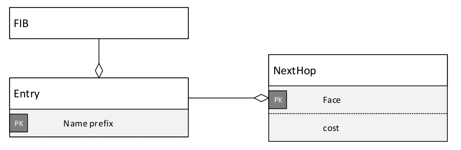
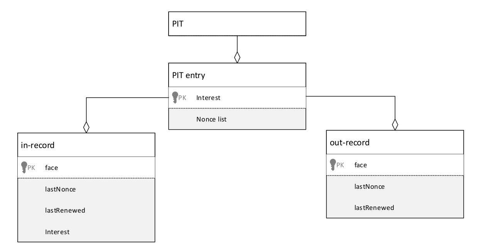

*tables* 模块提供NFD的主要数据结构（ *data structures* ）。

**转发信息库** （FIB，*Forwarding Information Base* ）（第3.1节）用于将兴趣包转发到匹配数据（ *matching Data* ）的潜在源（ *potential source(s)* ）。它与IP的FIB表类似，只是它允许列出传出的 *face* 是一个 *face* 列表而不是单个 *face* 。

**网络区域表** （ *The Network Region Table* ，第3.2节）包含用于移动性支持（ *mobility support* ）的生产者区域名称的列表。

**内容存储** （CS，*Content Store* ，第3.3节）是一个对数据包（ *Data packet* ）的缓存。为了满足将来请求相同数据的兴趣，将到达数据包尽可能长地放置在此缓存中。

**兴趣表** （PIT，*Pending Interest Table* ，第3.4节）跟踪（ *track* ）向上游内容源转发的兴趣（ *Interest* ），构造一条反向路劲，以便可以将数据向下游发送到其请求者。它还包含用于 **环路检测** 和 **测量目的** 的最近满足的兴趣（ *recently satisfied Interests* ）。

**Dead Nonce List** （第3.5节）作为未决兴趣表的补充，以进行循环检测。

**策略选择表** （*The Strategy Choice Table* ，第3.6节）包含为每个名称空间（ *namespace* ）选择的转发策略（第5节）。

转发策略使用 **测量表**（*The Measurements Table* ，第3.7节）来存储有关名称前缀的测量信息。

**FIB** 、**PIT** 、 **策略选择表** 和 **测量表** 在其索引结构上有很多共性。为了提高性能并减少内存使用，我们设计了 **名称树** （*Name Tree* 第3.8节）结构，用于在这四个表之间共享一个通用索引。

### 3.1 转发信息库（FIB）

转发信息库（FIB）用于将兴趣包转发到匹配数据的潜在源[9]。对于需要转发的每个兴趣，将在FIB上执行最长的前缀匹配（ *longest prefix match* ）查找，并且存储在找到的FIB条目中的传出 *face* 列表是转发（ *forwarding* ）的重要参考。

第3.1.1节概述了FIB的结构（ *structure* ）、语义（ *semantic* ）和算法（ *algorithm* ）。第3.1.2节介绍了NFD其余的部分是如何如何使用FIB的。FIB算法的实现将在3.8节中讨论。

#### 3.1.1 结构和语义

图5  FIB及其相关的条目

- **FIB条目和下一跳记录**

  FIB条目（`nfd::fib::Entry`）包含 **名称前缀** （ *Name prefix* ）和 **下一跳记录** （ *Nexthop record* ）的非空集合。FIB表中有某个前缀的FIB条目意味着，如果收到以该名称前缀开头的兴趣包，则可以通过此FIB条目中的下一跳记录所提供的 *face* 来找到匹配数据的潜在来源。

  每个下一跳记录（`nfd::fib::NextHop`）包含面向潜在内容源的传出 *face* 及其路由成本（ *cost* ）。 一个FIB条目最多可以包含一个朝向同一出口（ *outgoing* ） *face* 的下一跳记录。在FIB条目中，下一跳记录按升序排序。路由成本是下一跳记录之间的相对成本，具体值为多少无关紧要。

  与RIB（第7.3.1节）不同，FIB条目之间没有继承（ *inheritance* ）。FIB条目中的下一跳记录列表是此FIB条目仅有的“有效”下一跳列表。

- **FIB**

  FIB（`nfd::Fib`）是FIB条目的集合，按名称前缀索引。支持通常的插入、删除及完全匹配（ *exact match* ）操作。FIB条目可以在前向迭代器中以未指定的顺序进行迭代。

  最长前缀匹配算法（`Fib::findLongestPrefixMatch`）找到FIB条目，该条目应用于指导兴趣的转发。 它以名称作为输入参数。此名称应该是兴趣（ *Interest* ）中的名称字段。返回值是FIB条目，其名称前缀为：

  - （1）输入参数参数的前缀
  - （2）在满足条件（1）的结果中的的最长者，如果没有FIB条目满足条件（1），则返回NULL。

#### 3.1.2 使用（ *Usage* ）

**FIB仅通过使用FIB管理协议来更新** ，该协议在NFD方面由FIB管理器（ *FIB manager* ）操作（第6.5节）。通常， `FIB manager` 从`RIB Management`（第7节）获取命令，`RIB Management`既接收手动配置（ *configured manually* ）或由应用程序注册的静态路由，也接收来自路由协议的动态路由。由于大多数FIB条目最终都来自动态路由，因此，如果网络具有少量的公告前缀，则FIB预计将包含少量条目。

FIB预计会相对稳定。FIB更新由RIB更新触发，而RIB更新又是由手动配置、应用程序启动或关闭以及路由更新引起的。在稳定的网络中，这些事件很少发生。但是，每个RIB更新都会导致大量FIB更新，因为一个RIB条目的更改可能会由于继承而影响其后代。

最长前缀匹配算法用于传入兴趣管道（ *incoming Interest pipeline* ）中的转发（第4.2.1节）。对于每个传入兴趣最多调用一次。

`cleanupOnFaceRemoval`函数（在`daemon/table/cleanup.hpp`中声明）是一个在 *face* 移除时用于FIB-PIT清理的函数。当一个 *face* 销毁（ *destroyed* ）后会调用此函数。它访问所有FIB和PIT条目，并删除FIB下一跳记录，PIT入记录和PIT出记录，这些记录指向已删除的 *face* 。丢失最后一条下一跳记录的FIB条目也将被删除。不同的是，丢失所有其入记录和出记录的PIT条目被保存在表$^2$中。FIB和PIT的清除在同一函数中执行，因为两个表都存储在`NameTree`中（第3.8节），因此此函数可以在一次`NameTree`枚举中清除两个表。

> $^2$ This is pending discussion in [https://redmine.named-data.net/issues/3685#note-7](https://redmine.named-data.net/issues/3685#note-7).

### 3.2 网络区域表（Network Region Table）

网络区域表（`nfd::NetworkRegionTable`）用于移动性支持（第4.2.4节）。 它包含一组无序的生产者区域名称，这些名称取自NFD配置文件（第6.7.2节）。如果兴趣的转发提示（ *forwarding hint* ）中的任何委托名称（ *delegation name* ）是此表中任何区域名称的前缀，则表示兴趣已到达生产者区域，应根据其名称而不是委托名称进行转发。

### 3.3 内容存储（CS）

内容存储（CS）是用作数据包的缓存。转发管道（ *Forwarding pipeline* ，第4节）将到达的数据包放在CS中，这样就可以满足将来请求相同数据的兴趣，而无需进一步转发。

CS提供了插入数据包，查找与兴趣匹配的缓存数据以及枚举缓存数据的过程。第3.3.1节描述了这些过程的语义及其用法。

CS在（`nfd::cs::Cs`）类中实现。该实现由两部分组成：查找表（ *lookup table* ）和缓存替换策略（ *cache replacement policy* ）。查找表（第3.3.2节）是CS条目的基于名称的索引，其中存储了缓存的数据包。缓存替换策略（第3.3.3节）负责将CS保持在容量限制之下。它单独维护一个清理索引，以便确定在CS满（ *full* ）时删除哪个条目。 NFD提供了多种缓存替换策略，包括优先级FIFO策略和LRU策略，可以在NFD配置文件中选择它们。

#### 3.3.1 语义和使用（Semantic and Usage）

- **插入（Insertion）**

  不管是在 *incoming Data pipleline* （第4.3.1节）还是在 *Data unsolicited pipleline* （第4.3.2节）中，对于任意的数据包，只要 *forwarding* 可确保其完全符合要处理的数据包的条件，该数据包就会被插入CS（`Cs::insert`）中 。（例如，数据包不违反基于名称的范围控制[10]）。

  在存储数据包之前，先评估准入策略（ *admission policy* ）。本地应用程序可以通过附加到数据包的NDNLPv2 [5] `CachePolicy`字段来提示接纳策略，这些提示被认为是建议性的。

  通过准入策略后，数据包（ *Data packet* ）将被存储下来，同时保存该数据包过时（ *stale* ）的时间点（ *time point* ），并且不会去满足带有`MustBeFresh Selector`的兴趣（ *Interest* ）。

  CS配置有容量限制，此时将对其进行检查。如果此新数据包的插入导致CS超过容量限制，则缓存替换策略将驱逐过多的条目以使CS处于容量限制之下。

- **查找（Lookup）**

  CS提供了一个`异步`查找API（`Cs::find`）。 *incoming Interest pipleline* （第4.2.1节）使用传入兴趣（ *Interetst* ）来调用此API。搜索算法会将与兴趣（ *Interest* ）最匹配的数据包（ *Data packet* ）提供给 *ContentStore hit pipleline* （第4.2.3节），或者如果没有匹配项，则通知 *ContentStore miss pipleline* （第4.2.4节）。

- **枚举和条目抽象（Enumeration and Entry Abstraction）**

  可以通过正向迭代器（ *forward iterators* ）枚举 *Content Store* 。此功能未在NFD中直接使用，但在仿真环境中可能很有用。

  为了保持稳定的枚举接口，且仍允许替换CS实现，将迭代器取消引用（ *dereferenced* ）为`nfd::cs::Entry`类型，这是CS条目的抽象。这种类型的公共API允许调用者获取数据包，无论它是否是自发的，以及何时该数据包会过时。内容存储实现可以定义自己的具体类型，并在枚举期间转换为抽象类型。

#### 3.3.2 查询表（Lookup Table）

*Table* 是一个有序的容器，用于存储具体的条目（`nfd::cs::EntryImpl`，条目抽象类型的子类）。该容器按具有隐式摘要（ *implicit digest* ）的数据名称排序。$^3$

> $^3$ 隐式摘要计算会占用大量CPU。该表进行了优化，可以在大多数情况下避免隐式摘要计算，同时仍保证正确的排序顺序。

查找完全使用表来完成。NFD优化了查找过程（`Cs::find*`），以最大程度地减少预期情况下访问的条目数。在最坏的情况下，查找将访问所有以兴趣名称为前缀的条目。

尽管查找API是异步的，但当前实现会同步进行查找。

该表使用`std::set`作为基础容器，因为它在基准测试中表现良好。先前的CS实现使用 *skip list*，但其性能比std :: set差，这可能是由于算法复杂性和代码质量所致。

#### 3.3.3 缓存替换策略（Cache Replacement Policy）

缓存替换策略将CS保持在其容量限制内。主要容量限制是根据缓存的数据包的数量来衡量的。选择此度量标准而不是选择数据分组大小，因为表索引的内存开销对于小数据包可能很重要，因此数据包大小度量标准将不准确。可以在NFD配置文件`table.cs\_max\_packets`项中配置此容量限制，也可以在模拟环境中通过`Cs::setLimit`API进行配置。 允许运行时更改容量限制。

NFD通过实现`nfd::cs::Policy`的多个子类提供多种策略实现 可以在NFD配置文件`table.cs\_policy`项中配置有效策略，也可以在模拟环境中通过`Cs::setPolicy`API进行配置。此配置只能在初始化期间应用，不允许在运行时更改。

- **策略类API（Policy class API）**

  `nfd::cs::Policy`是所有缓存替换策略实现的基类。

  容量限制存储在`Policy`类上，可以通过`Policy::setLimit`公共方法进行更改。策略实现必须提供基类中纯虚函数`evictEntries`的实现，以便基类`Policy::setLimit`公共方法通过驱逐足够的条目使CS重新回到新的容量限制下，来处理容量限制的降低。除了主要容量限制（称为“硬限制-*hard limit* ”）之外，策略还可以提供其他容量限制（例如证书的单独限制或基于数据包大小的限制）。

  为了使策略维持容量限制，它需要知道哪些数据包已添加到缓存及其访问模式。 因此，策略类公开了四个公共方法来接收这些信息：

  - 插入新条目后，将调用`Policy::afterInsert`；
  - 在同一数据刷新现有条目后，将调用`Policy::afterRefresh`；
  - `Policy::beforeErase`将在通过管理命令删除条目之前被调用（当前未使用）；
  - 当通过查找找到某个条目并将其用于转发之前，将调用`Policy::beforeUse`。

  这些公共方法调用相应的纯虚函数：`doAfterInsert`、`doAfterRefresh`、`doBeforeErase`和`doBeforeUse`。 这些纯虚函数以及`evictEntries`应该在子类中重写（ *overriden* ）。

  根据通过上述API收到的信息，策略会维护一个内部清除索引，该索引用于确定在CS超过容量限制时应清除哪个数据包。在每个策略实施中都定义了此内部清理索引的结构。它应该通过迭代器（`nfd::cs::iterator`）引用CS条目（存储在表中）。当策略决定逐出一个条目时，它应该发出`beforeEvict`信号来通知CS从表中删除该条目，然后删除该策略的内部清除索引中的相应项目。请注意，对于**通过`beforeEvict`信号驱逐的条目，不会调用`beforeErase`。**

  每个函数实现时的建议步骤如下：

  - 在`doAfterInsert`中，策略决定是否接受新条目。如果接受，则应将新条目的迭代器插入内部清除索引；否则，将调用`cs::Policy::evictEntries`通知CS进行清理。然后，该策略应检查CS大小是否超过容量限制，如果是，则逐出一个条目（可能通过调用`evictEntries`函数）；
  - 在`doAfterRefresh`中，策略可能会更新其清理索引，以处理同一数据再次到达；
  - 在`doBeforeErase`中，策略应删除其清理索引中的相应条目；
  - 在`doBeforeUse`中，策略可以更新其清除索引，以标记指定的条目满足了一个传入的兴趣。
  - 在`evictEntries`中，策略应逐出足够的条目，以使CS不会超过容量限制。

- **优先级FIFO缓存策略（Priority FIFO cache policy）**

  `Priority-FIFO`是默认的`cs::Policy`。优先级FIFO会在每次插入时逐出，因为其性能更可预测，否则，定期清除一批条目可能会导致数据包转发中的抖动。Priority-FIFO使用三个队列来跟踪CS中的数据包：

  - **未经请求的队列（ *unsolicited queue* ）** 包含具有未经请求的数据的条目；
  - **过时队列（ *stale queue* ）**包含具有过时数据的条目；
  - **FIFO队列包**含带有新数据的条目。

  在任何时候，一个条目完全属于一个队列，并且在该队列中只能出现一次。优先级FIFO保持每个条目所属的队列。

  这些字段与存储在队列中的Table迭代器一起，在Table和队列之间建立双向关系。

  **变异操作**（ *Mutation operations* ）时必须保持这种关系：

  - 插入条目时，该条目将放置在表格中；
  - 逐出一个条目时，其表迭代器将从其队列的开头删除，并且该条目也从表中删除；
  - 当新条目变为陈旧时（由计时器控制）时，其表迭代器将从FIFO队列移至过时队列，并且条目上的队列指示符和迭代器也将更新；
  - 使用请求的数据更新主动/过期条目时，其表迭代器从主动/过期队列移至FIFO队列，并且条目上的队列指示符和迭代器也更新。

  尽管名为队列（ *queue* ），但这里的队列并不是真正的先进先出队列，因为条目可以在队列之间移动（请参阅上面的变异操作）。移动条目时，其表迭代器将从旧队列中分离出来，并附加到新队列中。`std::list`用作基础容器，`std::queue`和`std::deque`不适合，因为它们无法有效地分离节点。

- **LRU缓存策略（LRU cache policy）**

  LRU缓存策略实现了最近最少使用的缓存替换算法，该算法首先丢弃最近最少使用的项目。LRU每次插入都会被逐出，因为它的性能更可预测，否则，定期清除一批条目可能会导致数据包转发中的抖动。

  LRU使用一个队列来跟踪CS中的数据使用情况，表迭代器存储在队列中。在任何时候，使用或刷新条目时，其表迭代器都会重定位到队列的尾部。同样，当新插入一个条目时，其表迭代器会被推入队列的尾部。当需要逐出一个条目时，将从其队列的开头删除其表迭代器，并从表中删除该条目。

  队列使用`boost::multi_index_container`[11]作为基础容器，因为它在基准测试中表现良好。`boost::multi_index_container::sequenced_index`用于插入，更新使用和刷新，`boost::multi_index_container::ordered_unique_index`用于通过`Table::iterator`擦除。

### 3.4 兴趣表（PIT）

兴趣表（PIT）跟踪向上游内容源转发的兴趣，以便可以将数据向下游发送到其请求者[9]。它还包含用于 **环路检测** 和 **测量目的** 的最近满足的兴趣。这种数据结构在NDN文献中称为 **未决兴趣表**（ *pending Interest table* ） ； 但是，**NFD的PIT包含未满足的兴趣和最近满足的兴趣**，因此“兴趣表”是一个更准确的术语，但缩写为“ PIT”。

PIT是PIT条目的集合，仅用于转发（ *forwarding* ，第4节）。 3.4.1节介绍了PIT条目的结构和语义，以及转发如何使用它。3.4.2节介绍了PIT的结构和算法，以及转发如何使用它。PIT算法的实现在3.8节中讨论。

#### 3.4.1 PIT条目（PIT Entry）

图6显示了PIT，PIT条目、入记录（ *in-records* ）、出记录（ *out-records* ）以及它们的关系。

图6  PIT及其相关的entities

- **PIT条目（PIT entry）**

  PIT条目（`nfd::pit::Entry`）表示未决兴趣或最近满足的兴趣。如果两个兴趣包具有相同的名称（ *Name* ）和选择器（ *Selectors* ）[1]，则它们是相似的（ *similar* ），多个相似兴趣共享同一PIT条目。

  每个PIT条目均由一个兴趣标识。除名称（ *Name* ）和选择器（ *Selectors* ）外，此兴趣中的所有字段均无关紧要。

  每个PIT条目包含一个入记录（ *in-records* ）、一个出记录（ *out-records* ）和一个计时器（ *timer* ），如下所述。另外，允许转发策略存储有关PIT条目，入记录和出记录的任意信息（第5.1.3节）。

- **入记录（In record）**

  入记录（`nfd::pit::InRecord`）表示兴趣的下游 *face* （ *downsream face* ）。下游 *face* 是内容的请求者 ：兴趣来自下游（ *downstream* ），且数据也会流向下游。

  入记录（ *in-record* ）中存储有下列信息：

  - *face* 的引用
  - 来自此 *face* 的最后一个兴趣包中的`Nonce`
  - 来自此 *face* 的最后一个兴趣包到达的时间戳（ *timestamp* ）
  - 最后一个兴趣包

  > ps: 上述提到的最后一个兴趣包，即为包含入记录的PIT条目中的最新插入的一个兴趣包

  *incoming Interest pipeline* （第4.2.1节）会插入或更新入记录（ *in-record* ）。当一个未决兴趣时被满足时，所有的入记录（ *每个PIT条目中都会维护一个入记录列表，这边说的所有的入记录指的是被满足兴趣所在的PIT条目中保存的入记录列表* ）都会被 *incoming Data pipeline* 删除（第4.3.1节）。

  在最后一个来自同个 *face* 的相同兴趣包到达后，经过`LifetyLifetime`，对应的入记录将过期。当所有的入记录都到期时，PIT条目也会到期。如果一个PIT条目包含至少一个未过期的入记录，则称其为未决。

- **出记录（Out record）**

  出记录（`nfd::pit::OutRecord`）表示兴趣的上游 *face* （ *upstream face* ） 。上游 *face* 是潜在的内容来源：兴趣被转发到上游（ *upstream* ），且而数据来自上游。
  出记录（ *out-record* ）中存储有下列信息：

  - *face* 的引用
  - 发送给此 *face* 的最后一个兴趣包中的Nonce
  - 发送给此 *face* 的最后一个兴趣包的时间戳（ *timestamp* ）
  - `Nacked`字段：指示最后一个发出的（ *outgoing* ）的兴趣已被Nacked，此字段还记录了Nack的原因（ *Nack reason* ）

  *outgoing Interest pipeline* （第4.2.5节）会插入或更新出记录（ *out-record* ）。当来自该 *face* 的数据满足未决兴趣时，出记录将由 *incoming Data pipeline* 删除（第4.3.1节）。

  发送最后一个兴趣包后，如果经过了`LifetyLifetime`，则记录过期（ *expires* ）。

- **计时器（Timer）**

  每个PIT条目都有一个计时器，即到期计时器（ *expiry timer* ）。该计时器由 *forwarding pipeline* 使用（第4节），并且在PIT条目到期时触发（第4.2.1节）。

#### 3.4.2 PIT

PIT（`nfd::Pit`）是一个包含PIT条目的表，由`<Name，Selectors>` *tuple* 索引。支持通常的插入和删除操作。 `Pit::insert`方法首先查找具有相似兴趣的PIT条目，并仅在不存在的情况下插入一个。没有完全匹配的单独方法，因为 *forwarding* 不需要插入PIT条目就可以确定它的存在。PIT是不可迭代的，因为 *forwarding* 不需要这样做。

数据匹配算法（`Pit::findAllDataMatches`）查找数据包可以满足的所有兴趣。它以数据包作为输入参数。返回值是此数据包可以满足的PIT条目的集合。此算法不会删除任何PIT条目。

`cleanupOnFaceRemoval`函数是去除 *face* 时的联合FIB-PIT清理功能。 有关更多信息，请参见第3.1.1节。

### 3.5 Dead Nonce List

*Dead Nonce List* 是为 **循环检测** 目的 **补充PIT的数据结构** 。

2014年8月，当`InterestLifetime`较短时（Bug#1953），我们发现了一个持久循环问题。循环检测以前仅使用存储在PIT条目中的随机数。如果在`InterestLifetime`内未满足兴趣，则将删除PIT条目。当网络包含一个延迟时间长于`InterestLifetime`的循环时，由于在PIT条目在Interest循环返回之前就消失了，因此无法检测到围绕此循环的循环Interest。

对于此持久循环问题的朴素解决方案是将PIT条目保留更长的时间。但是，这样做的内存消耗将太高，因为PIT条目包含了除Nonce之外的许多其他内容。因此，引入了 *Dead Nonce List* 以从存储PIT中“dead”的 *Nonce* 。

*Dead Nonce List* 是NFD中的全局容器。此容器中的每个条目都存储一个Name和Nonce元组。可以有效地查询条目的存在。条目会保留一段时间，在此期间，兴趣不太可能回滚。

3.5.1节介绍了 *Dead Nonce List* 的结构和语义，以及 *fowarding* 是如何使用它的。第3.5.2节讨论了如何维护 *Dead Nonce List* 的容量（ *capacity* ）。

#### 3.5.1 结构、语义和使用（Structure, Semantics and Usage）

在 *incoming Data pipeline* （第4.3.1节）和 *Interest finalize pipeline* （第4.2.6节）处理过程中，出记录（ *out-record* ）被删除之前，一个 *tuple* `<Name, Nonce>` 被添加进 *Dead Nonce List* （`DeadNonceList::add`）。

在 *incoming Interest pipeline* 处理过程中会通过调用`DeadNonceList::has`去查询  *Dead Nonce List* 。如果存在具有相同 *Name* 和 *Nonce* 的条目，则传入的兴趣是被判定为循环兴趣。

*Dead Nonce List* 是一个概率数据结构（ *probabilistic data structure* ）：每个条目都存储为 *Name* 和 *Nonce* 的64位哈希，这大大减少了数据结构的内存消耗。同时，哈希冲突的可能性非零，这不可避免地导致误报：非循环兴趣被误认为循环兴趣。这些误报是可以恢复的：消费者可以用新的Nonce重新传输兴趣，这很可能会产生与现有哈希不冲突的其他哈希。我们认为，节省内存可带来的好处胜过误报的危害。

#### 3.5.2 容量维护（Capacity Maintenance）

条目将保留在 *Dead Nonce List* 中以保持可配置的生命周期。条目的生存期是在循环检测的有效性，容器的内存消耗和误报率之间进行权衡。较长的生存时间可提高环路检测的效率，因为循环的兴趣只有在删除条目之前到达才能被检测到，因此，较长的生存时间允许在延迟更大的网络中检测循环兴趣。另一方面，较长的条目生存期导致要存储更多条目，因此增加了容器的内存消耗，同时保留更多条目也意味着哈希冲突的可能性更高，因此也就产生了误报。默认条目生存期设置为6秒。

实现条目生命周期的朴素方法是在每个条目中保留时间戳，但这种方法消耗太多内存。由于 *Dead Nonce List* 是一个概率数据结构，因此输入生存期不需要精确。因此，我们将容器索引为先进先出队列，并通过调整容器的容量将条目生存期近似为配置的生存期。

静态配置容器的容量是不可行的，因为添加条目的频率与兴趣到达率相关，而操作员无法准确估算。因此，我们使用以下算法动态调整容量近似预期的（ *expected* ）生存期L：

- 每间隔M时间，我们向容器添加一个称为 *mark* 的特殊条目。*mark* 不是一个独特的类型，它是具有特定值的条目（ *也是一个hash值，不过是一个预设的特定hash值，有可能被碰撞，但概率极低* ），并假设哈希函数不可逆，因此与通过 *Name* 和 *Nonce* 计算得出的哈希值冲突的可能性很低；
- 每间隔M时间，我们计算容器中 *mark* 的数量，并记住该计数。添加 *mark* 与计数 *mark* 之间的顺序无关紧要，但应保持一致；
- 每间隔A时间，我们查看最近的计数。当容器的容量最佳时（ *optimal* ），容器中应始终有$\frac{L}{M}$个 *mak* 。如果所有最近的计数都高于$\frac{L}{M}$，那么容量将减少。如果所有最近的计数都低于$\frac{L}{M}$，那么容量将增加。

此外，容量还有严格的上限和下限，以避免内存溢出并确保正确的操作。当将容量调低至受限的算法执行时间时，多余的条目不会立即全部清除，而是在以后的插入操作期间成批清除。

### 3.6 策略选择表（Strategy Choice Table）

**策略选择表** （ *Strategy Choice Table* ）包含为每个名称空间（ *namespace* ）选择的转发策略（第5节）。该表是NDN架构的新增功能。从理论上讲，转发策略是一种应该存储在FIB条目中的程序[9]。实际上，由于以下原因，我们发现将转发策略保存在单独的表中而不是将其与FIB条目一起存储更方便：

- FIB条目来自由NFD-RIB服务管理的RIB条目（第7节），将策略存储在FIB条目中将要求RIB服务在操作FIB时创建/更新/删除策略，因此，这将增加RIB服务的复杂性；
- 当删除最后一个`NextHop`记录时（包括最后一个上游 *face* 失败时），FIB条目将自动删除，但是，我们不想丢失已配置的策略；
- 策略配置的粒度不同于RIB条目或FIB条目的粒度，将两者放在同一个表中会使继承处理更加复杂。

3.6.1节概述了策略选择表的结构，语义和算法。第3.6.2节介绍了NFD其余部分如何使用策略选择表。策略选择表算法的实现在3.8节中讨论。

#### 3.6.1 结构和语义（Structure and Semantics）

- **策略选择条目（Strategy Choice entry）**

  策略选择条目（`nfd::strategy_choice::Entry`）包含名称前缀和为该名称空间选择的转发策略。在运行时会创建一个`nfd::fw::Strategy`子类实例，并将其存储在每个策略选择条目内。

- **策略选择表（Strategy Choice Table）**

  策略选择表（`nfd::StrategyChoice`）是策略选择条目的集合。**每个名称空间只能设置一个策略，但是子名称空间可以对策略有自己的选择** 。

  为了确保每个名称空间都有一个策略，NFD始终在初始化期间将`/`名称空间的根条目插入到策略选择表中（ *这个根条目默认可以匹配所有的名称空间* ）。为此条目选择的策略称为默认策略，由`daemon/fw/forwarder.cpp`中的硬编码`getDefaultStrategyName`  *free* 函数定义。可以替换默认策略，但是策略选择表中的根条目永远不能删除（ *这样才能保证所有的名称空间都有一个默认的策略* ）。

  > *free function* ：自由函数，定义在类外的函数，非成员函数 

  插入操作（`StrategyChoice::insert`）插入“ **策略选择** （ *Strategy Choice* ）”条目，或在现有条目上更新所选策略。此操作接受应用 **策略选择** 的名称前缀和策略实例名称。策略实例名称以表示策略“ **程序** （ *program* ）”的名称前缀开头，例如`ndn:/localhost/nfd/strategy/best-route`。除此之外，它可能包含一个可选的版本号以选择策略程序的特定版本，以及其他名称组件（作为“参数”），这些名称组件将传递给策略构造器。策略实例名称用于在策略注册表中定位策略类型（在`nfd::fw::Strategy`类内）。如果找到策略类型，则将其实例化并存储到“ **策略选择** ”条目中。

  删除操作（`StrategyChoice::erase`）删除策略选择条目。删除所覆盖的名称空间将继承在父名称空间上定义的策略，不允许删除根条目。

  支持通常的精确匹配（ *exact match* ）操作。可以使用前向迭代器以未指定的顺序迭代“策略选择”条目。
  查找有效策略算法（`StrategyChoice::findEffectiveStrategy`）查找应用于转发兴趣的策略。名称空间的有效策略可以定义如下：

  - 如果名称空间与策略明确关联，则这是有效的策略；
  - 否则，为其显式设置策略的第一个父名称空间定义有效策略。

  查找有效策略算法将名称，PIT条目或测量条目作为输入参数。该算法的返回值是一种转发策略，使用提供的名称通过 **最长前缀匹配** 找到该策略。 此返回值始终是有效条目，因为每个名称空间都必须具有策略。

#### 3.6.2 使用（Usage）

**策略选择表仅通过管理协议进行更新**。策略选择管理器（第6.6节）直接负责更新策略选择表。

由于本地NFD管理员（个人计算机用户或网络路由器的系统管理员）将手动选择策略，因此“策略选择”有望保持稳定。

有效的策略搜索算法被 *forwarding* 用于 *ContentStore miss pipeline* （第4.2.4节）， *incoming Data pipeline* （第4.3.1节）和 *incoming Nack pipeline* （第4.4.1节）。每个传入数据包（ *packet* ）最多调用两次。

### 3.7 测量表（Measurement Table）

转发策略使用“测量表”来存储有关名称前缀的测量信息。策略可以在 *PIT* 和 *Measurements* 中存储任意信息（第5.1.3节）。*Measurements Table* 按名称空间建立索引，因此适合存储与名称空间相关联但不特定于兴趣的信息。

测量表的结构和算法在第3.7.1节中概述。 第3.7.2节介绍了NFD其余部分如何使用“测量表”。 在3.8节中讨论了 *Measurements Table* 算法的实现。

#### 3.7.1 结构（Structure）

