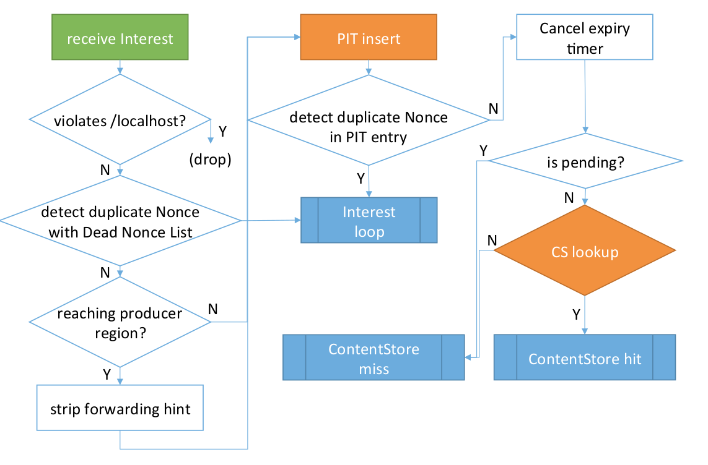

NFD具有智能转发平面（ *smart forwarding plane* ），该平面由 **转发管道** （ *forwarding pipelines* ，第4节）和 **转发策略** （ *forwarding strategies* ，第5节）组成。 **转发管道（或管道）由数据包上的一系列处理步骤组成**。 此外，当某个事件被触发（ *an event is triggered* ）并且匹配一定条件（ *a condition is matched* ）时将开启 *pipeline* 处理流程（ *a pipeline is entered* ）。例如，在接收到`Interest`时，在检测到接收到循环的`Interest`时，在准备将`Interest`从 *face* 转发出去时等。转发策略（或策略）在`packet`转发时进行决策，包括是否，何时以及在何处转发`packet`。NFD可以有多个服务于不同名称空间的策略，并且管道将相应地向策略提供`packet`。

图7显示了转发管道和策略的总体工作流程，其中蓝色框代表管道，白色框代表策略的决策点。


<center>图7  转发和策略的整体工作流程</center>

### 4.1 转发管道（Forwarding Pipelines）

管道（ *pipelines* ）处理网络层数据包（`Interest`、`Data`或`Nack`），并且每个数据包都从一个管道传递到另一个管道（在某些情况下通过策略决策点），直到所有处理流程完成为止。管道内的处理使用CS、PIT、Dead Nonce List、FIB、网络区域表和策略选择表，但是管道对后三个表仅具有只读访问权限，因为这些表由相应的管理器管理，并且不直接受数据面流量的影响。

`FaceTable`跟踪NFD中所有活动的 *face* 。它是进入网络层数据包从中进入转发管道进行处理的入口点。管道还可以通过 *face* 发送数据包。

NDN中对`Interest`、`Data`和`Nack`数据包的处理是完全不同的。我们将转发管道分为 **兴趣处理路径** （ *Interest processing path* ）、 **数据处理路径** （ *Data processing path* ）和 **Nack处理路径** （ *Nack processing path* ），这将在以下各节中进行介绍。

### 4.2 兴趣处理路径（Interest Processing Path）

NFD将`Interest`处理分为以下管道：

- **Incoming Interest** ：处理收到的`Interest`
- **Interest loop** ：处理收到的循环`Interest`
- **ContentStore hit** ：处理可通过缓存的数据满足的传入`Interest`
- **ContentStore miss** ：处理缓存数据无法满足的传入`Interest`
- **Outgoing Interest** ：准备并发出`Interest`
- **Interest finalize** ：删除PIT条目

#### 4.2.1 Incoming Interest Pipeline

> 下面插入的代码片段取自 => [`NFD/daemon/fw/forwarder.cpp` => `Forwarder::onIncomingInterest`](https://gitea.qjm253.cn/PKUSZ-future-network-lab/MIR/src/branch/master/daemon/fw/forwarder.cpp)

```cpp
void
Forwarder::onIncomingInterest(const FaceEndpoint& ingress, const Interest& interest)
```

**incoming Interest pipeline** 在`Forwarder::onIncomingInterest`方法中实现，并从`Forwarder::startProcessInterest`方法输入，该方法由`Face::afterReceiveInterest`信号触发。**incoming Interest pipeline** 的输入参数包括新接收到的`Interest`和对接收到该`Interest`的 *face* 的引用。

该管道包括以下步骤，总结在图8中：



<center>图8  incoming Interest pipeline</center>

1. 第一步是检查收到的`Interest`是否违反`/localhost` *scope* [10] 限制。特别是，来自非本地 *face* 的`Interest`名称不允许以`/localhost`前缀开头，因为它是为`localhost`通信保留的。如果检测到违规，则立即删除`Interest`，并且不执行进一步的处理。此检查可防止恶意的发包者（ *malicious senders* ）。一个合规的转发器（ *forwarder* ）永远不会将以`/localhost`开头的`Interest`发送给非本地用户。请注意，此处不检查`/localhop` *scope* ，因为它的范围规则不限制传入的兴趣。

   ```cpp
   // /localhost scope control
   bool isViolatingLocalhost = ingress.face.getScope() == ndn::nfd::FACE_SCOPE_NON_LOCAL &&
       scope_prefix::LOCALHOST.isPrefixOf(interest.getName());
   if (isViolatingLocalhost) {
       NFD_LOG_DEBUG("onIncomingInterest in=" << ingress
                     << " interest=" << interest.getName() << " violates /localhost");
       // (drop)
       return;
   }
   ```

   > [10] J. Shi, “Namespace-based scope control,” https://redmine.named-data.net/projects/nfd/wiki/ScopeControl.

2. 对照 *Dead Nonce List* 表（第3.5节）检查传入 `Interest` 的 *Name* 和 *Nonce* 。如果找到匹配项，则将传入的 `Interest` 怀疑为一个循环的 `Interest`，并将其传递给给 **兴趣循环管道** （*Interest loop*）以进行进一步处理（第4.2.2节）。如果未找到匹配项，则处理继续进行到下一步。请注意，与通过PIT条目检测到的重复 *Nonce* 不同（如下所述），由 *Dead Nonce List* 检测到的重复不会导致创建PIT条目，因为为此传入 `Interest` 创建 *in-record* 会导致匹配的数据（如果有）被返回到下游，这是不正确的；另一方面，创建没有记录的PIT条目对将来重复Nonce检测没有帮助。

   ```cpp
   // detect duplicate Nonce with Dead Nonce List
   bool hasDuplicateNonceInDnl = m_deadNonceList.has(interest.getName(), interest.getNonce());
   if (hasDuplicateNonceInDnl) {
       // goto Interest loop pipeline
       this->onInterestLoop(ingress, interest);
       return;
   }
   ```

3. 如果 `Interest` 带有转发提示（ *forwarding hint* ），则该过程（ *reaching producer region ?* ）通过检查转发提示对象（ *forwarding hint object* ）中的任何委托名称（ *delegation name* ）是否是网络区域表（*network region table*， 第3.2节）中任何区域名称的前缀来确定 `Interest` 是否已到达生产者区域。 如果是这样，转发提示（ *forwarding hint* ）将被删除，因为它已经完成了将 `Interest` 引入生产者区域的任务，并且不再需要。

   ```cpp
   // strip forwarding hint if Interest has reached producer region
   if (!interest.getForwardingHint().empty() &&
       m_networkRegionTable.isInProducerRegion(interest.getForwardingHint())) {
       NFD_LOG_DEBUG("onIncomingInterest in=" << ingress
                     << " interest=" << interest.getName() << " reaching-producer-region");
       const_cast<Interest&>(interest).setForwardingHint({});
   }
   ```

4. 下一步是使用 `Interst` 包中指定的名称和选择器查找现有的或创建新的PIT条目。至此，PIT条目成为传入 `Interest` 和后续管道的处理对象。请注意，NFD在执行 `ContentStore` 查找之前创建了PIT条目。做出此决定的主要原因是，由于 `ContentStore` 可能明显大于PIT，所以查询 `ContentStore` 的代价是高于查询 PIT 的，在下面即将讨论的一些情况下，是可以跳过CS查找，所以在查询 `ContentStore` 之前查询PIT或创建相应的表项是有助于减小查询开销的。

   ```cpp
   // PIT insert
   shared_ptr<pit::Entry> pitEntry = m_pit.insert(interest).first;
   ```

5. 在进一步处理传入 `Interest` 之前，查询 PIT 中对应表项的 *in-records* （ *这边查询的是同一个 PIT entry 的 in-record 列表* ）。如果在不同 *Face* 的记录中找到匹配项（ *即找到一个 in-record 记录，它的 Nonce 和传入 `Interest` 的 Nonce 是一样的，但是是从不同的 Face传入的* ），则可能是由于 `Interest` 循环或者是同一个 `Interest` 沿多个不同的路径到达，传入 `Interest` 被视为重复（ *loop* ）。并传递给兴趣循环管道（ *Interest loop* ）进行进一步处理（第4.2.2节）。 否则，处理继续。

   > 请注意，如果在同一个 p2p *Face* 收到相同 *Nonce* 的同名 `Interest`，则该 `Interest` 被视为合法重发，因为在这种情况下不存在持续循环的风险。

   ```cpp
   // detect duplicate Nonce in PIT entry
   int dnw = fw::findDuplicateNonce(*pitEntry, interest.getNonce(), ingress.face);
   bool hasDuplicateNonceInPit = dnw != fw::DUPLICATE_NONCE_NONE;
   if (ingress.face.getLinkType() == ndn::nfd::LINK_TYPE_POINT_TO_POINT) {
       // for p2p face: duplicate Nonce from same incoming face is not loop
       hasDuplicateNonceInPit = hasDuplicateNonceInPit && !(dnw & fw::DUPLICATE_NONCE_IN_SAME);
   }
   if (hasDuplicateNonceInPit) {
       // goto Interest loop pipeline
       this->onInterestLoop(ingress, interest);
       return;
   }
   
   // 下面是 fw::findDuplicateNonce 的实现
   int
   findDuplicateNonce(const pit::Entry& pitEntry, uint32_t nonce, const Face& face)
   {
     int dnw = DUPLICATE_NONCE_NONE;
   
     for (const pit::InRecord& inRecord : pitEntry.getInRecords()) {
       if (inRecord.getLastNonce() == nonce) {
         if (&inRecord.getFace() == &face) {
           dnw |= DUPLICATE_NONCE_IN_SAME;
         }
         else {
           dnw |= DUPLICATE_NONCE_IN_OTHER;
         }
       }
     }
   
     for (const pit::OutRecord& outRecord : pitEntry.getOutRecords()) {
       if (outRecord.getLastNonce() == nonce) {
         if (&outRecord.getFace() == &face) {
           dnw |= DUPLICATE_NONCE_OUT_SAME;
         }
         else {
           dnw |= DUPLICATE_NONCE_OUT_OTHER;
         }
       }
     }
   
     return dnw;
   }
   ```

6. 接下来，由于新的有效兴趣已到达，因此取消了PIT条目上的到期计时器（ *expiry timer* ），延长PIT条目的寿命。稍后可以在兴趣处理路径中重置计时器，例如，如果在 `ContentStore` 中找到匹配的数据。

7. 然后，管道将测试 `Interest` 是否未决（ *is pending ?* ），即PIT条目是否已经具有相同或另一个传入Face的另一个记录。回想一下，NFD的PIT条目不仅可以代表未决 `Interest` ，而且还可以代表最近满足的 `Interest` （第3.4.1节）。此测试等效于CCN节点模型[9]中的“具有PIT条目”，其PIT仅包含未决兴趣。=> **可以简单的认为，检查传入的 `Interest` 的PIT表项中是否包含其它记录，如果包含，这个兴趣包就是未决的**

8.  如果 `Interest` 是非未决的（ *not pending* ），则去 `ContentStore` 查询是否有对应的匹配项（`Cs::find`，第3.3.1节）。否则，不需要进行CS查找，直接传递给 *ContentStore miss* 管道处理，因为未决的 `Interest` 意味着先前查询过 `ContentStore` ，且在 `ContentStore` 中未能命中 。如果 `Interest` 是未决的（ *pending* ），根据CS是否匹配，选择将 `Interest` 传递给 *ContentStore miss* 管道（第4.2.4节）还是 *ContentStore hit* 管道（第4.2.3节）处理。

   ```cpp
   // is pending?
   if (!pitEntry->hasInRecords()) { // 非未决
       m_cs.find(interest,
                 bind(&Forwarder::onContentStoreHit, this, ingress, pitEntry, _1, _2),
                 bind(&Forwarder::onContentStoreMiss, this, ingress, pitEntry, _1));
   }
   else { // 未决
       this->onContentStoreMiss(ingress, pitEntry, interest);
   }
   ```

#### 4.2.2 Interest Loop Pipeline

> 下面插入的代码片段取自 => [`NFD/daemon/fw/forwarder.cpp` => `Forwarder::onInterestLoop`](https://gitea.qjm253.cn/PKUSZ-future-network-lab/MIR/src/branch/master/daemon/fw/forwarder.cpp)

```cpp
void
Forwarder::onInterestLoop(const FaceEndpoint& ingress, const Interest& interest)
```

*Interest Loop* 管道在 `Forwarder::onInterestLoop` 方法中实现，当在 *incoming Interest* 管道（第4.2.1节）检测到兴趣循环时会触发 *Interest Loop* 管道的处理逻辑。该管道的输入参数包括 *Interest* 及其传入 *Face*。

如果传入 `Interest` 的 *Face* 是点对点的（ *point-to-point* ），则会向传入 *Face* 发送一个原因代码为“重复”（ *Duplicate* ）的 `Nack` 。 由于在多路访问链路（ *multi-access link* ）上未定义 `Nack` 的语义，因此，如果传入 *Face* 是多路访问的（ *multi-access* ），则会简单地丢弃循环的兴趣。

```cpp
// if multi-access or ad hoc face, drop
if (ingress.face.getLinkType() != ndn::nfd::LINK_TYPE_POINT_TO_POINT) {
    NFD_LOG_DEBUG("onInterestLoop in=" << ingress
                  << " interest=" << interest.getName() << " drop");
    return;
}

NFD_LOG_DEBUG("onInterestLoop in=" << ingress << " interest=" << interest.getName()
              << " send-Nack-duplicate");

// send Nack with reason=DUPLICATE
// note: Don't enter outgoing Nack pipeline because it needs an in-record.
lp::Nack nack(interest);
nack.setReason(lp::NackReason::DUPLICATE);
ingress.face.sendNack(nack, ingress.endpoint);
```

#### 4.2.3 ContentStore Hit Pipeline

> 下面插入的代码片段取自 => [`NFD/daemon/fw/forwarder.cpp` => `Forwarder::onContentStoreHit`](https://gitea.qjm253.cn/PKUSZ-future-network-lab/MIR/src/branch/master/daemon/fw/forwarder.cpp)

```cpp
void
Forwarder::onContentStoreHit(const FaceEndpoint& ingress, const shared_ptr<pit::Entry>& pitEntry,
                             const Interest& interest, const Data& data)
```

*ContentStore Hit* 管道在 `Forwarder::onContentStoreHit` 方法中实现，当在 *incoming Interest* 管道（第4.2.1节）中执行 `ContentStore` 查找（第3.3.1节）并找到匹配项之后触发 *ContentStore Hit* 管道处理逻辑。该管道的输入参数包括 `Interest`，其传入 *Face* ，PIT条目和匹配的数据包。/ localhost

如图9所示，此管道首先将 `Interest` 的到期计时器设置为当前时间，然后调用 `Interest` 所选策略的 `Strategy::afterContentStoreHit` 回调。


```cpp
NFD_LOG_DEBUG("onContentStoreHit interest=" << interest.getName());
++m_counters.nCsHits;

data.setTag(make_shared<lp::IncomingFaceIdTag>(face::FACEID_CONTENT_STORE));
// FIXME Should we lookup PIT for other Interests that also match the data?

pitEntry->isSatisfied = true;
pitEntry->dataFreshnessPeriod = data.getFreshnessPeriod();

// set PIT expiry timer to now
this->setExpiryTimer(pitEntry, 0_ms);

// dispatch to strategy: after Content Store hit
this->dispatchToStrategy(*pitEntry,
                         [&] (fw::Strategy& strategy) { strategy.afterContentStoreHit(pitEntry, ingress, data); });
```

#### 4.2.4 ContentStore Miss Pipeline

> 下面插入的代码片段取自 => [`NFD/daemon/fw/forwarder.cpp` => `Forwarder::onContentStoreMiss`](https://gitea.qjm253.cn/PKUSZ-future-network-lab/MIR/src/branch/master/daemon/fw/forwarder.cpp)

```cpp
void
Forwarder::onContentStoreMiss(const FaceEndpoint& ingress,
                              const shared_ptr<pit::Entry>& pitEntry, const Interest& interest)
```

*ContentStore Miss* 管道在 `Forwarder::onContentStoreMiss` 方法中实现，当在 *incoming Interest* 管道（第4.2.1节）中执行 `ContentStore` 查找（第3.3.1节）并没有找到匹配项之后触发 *ContentStore Hit* 管道处理逻辑。 该管道的输入参数包括 `Interest` ，其传入 *Face* 和PIT条目。


如图10所示，该管道执行以下步骤：

1. 根据传入的 `Interest` 以及对应的传入 *Face* 决定在相应 PIT 条目中插入或者更新 *in-record* 。如果相应 PIT 条目中已经存在相同传入 *Face* 的 *in-record* 记录，（例如，兴趣正在由同一下游重新传输），只需使用新观察到的 `Interest` 的 *Nonce* 和到期时间（*expiration time*）更新原来的 *in-record* 记录即可。记录中的到期时间由兴趣数据包中的 *InterestLifetime* 字段控制； 如果省略 *InterestLifetime* ，则使用默认的4秒。

   ```cpp
   NFD_LOG_DEBUG("onContentStoreMiss interest=" << interest.getName());
   ++m_counters.nCsMisses;
   
   // insert in-record
   pitEntry->insertOrUpdateInRecord(ingress.face, interest);
   ```

2. PIT条目上的到期计时器设置为最后一个PIT *in-record* 到期的时间。当到期计时器到期时，将执行 *Interest Finalize* 管道（第4.2.6节）。

   ```cpp
   // set PIT expiry timer to the time that the last PIT in-record expires
   auto lastExpiring = std::max_element(pitEntry->in_begin(), pitEntry->in_end(),
                                        [] (const auto& a, const auto& b) {
                                            return a.getExpiry() < b.getExpiry();
                                        });
   auto lastExpiryFromNow = lastExpiring->getExpiry() - time::steady_clock::now();
   this->setExpiryTimer(pitEntry, time::duration_cast<time::milliseconds>(lastExpiryFromNow));
   ```

3. 如果 `Interest` 在其NDNLPv2 header 中携带 *NextHopFaceId* 字段，则管道将遵循此字段。在FaceTable中查找所选的下一跳  *Face*。如果找到 *Face*，则执行 *outgoing Interest* 管道（第4.2.5节）；如果该 *Face* 不存在，则删除 `Interest`。

   ```cpp
   // has NextHopFaceId?
   auto nextHopTag = interest.getTag<lp::NextHopFaceIdTag>();
   if (nextHopTag != nullptr) {
       // chosen NextHop face exists?
       Face* nextHopFace = m_faceTable.get(*nextHopTag);
       if (nextHopFace != nullptr) {
           NFD_LOG_DEBUG("onContentStoreMiss interest=" << interest.getName()
                         << " nexthop-faceid=" << nextHopFace->getId());
           // go to outgoing Interest pipeline
           // scope control is unnecessary, because privileged app explicitly wants to forward
           this->onOutgoingInterest(pitEntry, FaceEndpoint(*nextHopFace, 0), interest);
       }
       return;
   }
   ```

4. 如果没有 *NextHopFaceId* 字段，则转发策略负责对 `Interest` 做出转发决策。因此，管道将调用“查找有效策略”算法（ *Find Effective Strategy algorithm* ，第3.6.1节）来确定要使用的策略，并调用所选策略对象的 `Strategy::afterReceiveInterest` 回调。传入 *Interest* ，其传入 *Face* 和PIT条目（第5.1.1节）。

   ```cpp
   // dispatch to strategy: after incoming Interest
   this->dispatchToStrategy(*pitEntry,
                            [&] (fw::Strategy& strategy) {
                                strategy.afterReceiveInterest(FaceEndpoint(ingress.face, 0), interest, pitEntry);
                            });
   ```

#### 4.2.5 Outgoing Interest Pipeline

> 下面插入的代码片段取自 => [`NFD/daemon/fw/forwarder.cpp` => `Forwarder::onOutgoingInterest`](https://gitea.qjm253.cn/PKUSZ-future-network-lab/MIR/src/branch/master/daemon/fw/forwarder.cpp)

```cpp
void
Forwarder::onOutgoingInterest(const shared_ptr<pit::Entry>& pitEntry,
                              const FaceEndpoint& egress, const Interest& interest)
```

*Outgoing Interest* 管道在 `Forwarder::onOutgoingInterest` 方法中实现，并一般在 `Strategy::sendInterest` 方法内调用（ *也可能如上述 4.2.4 节所述，兴趣包携带了 NextHopFaceId 字段，此时也可能不经过策略决策，直接触发 Outgoing Interest 管道* ），该方法处理策略的发送兴趣动作（第5.1.2节）。该管道的输入参数包括PIT条目，传出 *Face* 和 `Interest` 。请注意，`Interest` 不是进入管道时的参数。管道步骤要么直接使用PIT条目执行检查，要么获取对存储在PIT条目内的 `Interest` 的引用。

该管道首先在PIT条目中为指定的传出 *Face* 插入一个 *out-record*，或者为同一 *Face* 更新一个现有的 *out-record*。 在这两种情况下，PIT记录都将记住最后一个传出兴趣数据包的 *Nonce* ，这对于匹配传入的Nacks很有用，还有到期时间戳，它是当前时间加上 *InterestLifetime* 。最后， `Interest` 被发送到传出的 `Face` 。

> PIT 表的结构参见 => [3.4 PIT](https://sunnyqjm.github.io/nfd-developer-guide-zh/#/chapter3?id=_34-兴趣表（pit）)

```cpp
NFD_LOG_DEBUG("onOutgoingInterest out=" << egress << " interest=" << pitEntry->getName());

// insert out-record
pitEntry->insertOrUpdateOutRecord(egress.face, interest);

// send Interest
egress.face.sendInterest(interest, egress.endpoint);
++m_counters.nOutInterests;
```

#### 4.2.6 Interest Finalize Pipeline

> 下面插入的代码片段取自 => [`NFD/daemon/fw/forwarder.cpp` => `Forwarder::onInterestFinalize`](https://gitea.qjm253.cn/PKUSZ-future-network-lab/MIR/src/branch/master/daemon/fw/forwarder.cpp)

```cpp
void
Forwarder::onInterestFinalize(const shared_ptr<pit::Entry>& pitEntry)
```

*Interest Finalize* 管道在 `Forwarder::onInterestFinalize` 方法中实现，一般是由到期计时器（ *expiry timer* ）到期时触发。

管道首先确定是否需要将记录在PIT条目中的任何 *Nonces* 插入到 *Dead Nonce List* 中（第3.5节）。*Dead Nonce List* 是一个旨在检测循环兴趣的全局数据结构，我们希望插入尽可能少的 *Nonces* 以减小其大小。只需要插入传出的 *Nonces* （在外记录中），因为未发送出去的 *incoming Nonce* 是不可能环回的。

```cpp
NFD_LOG_DEBUG("onInterestFinalize interest=" << pitEntry->getName()
              << (pitEntry->isSatisfied ? " satisfied" : " unsatisfied"));

// Dead Nonce List insert if necessary
this->insertDeadNonceList(*pitEntry, nullptr);
```

我们可以利用 `ContentStore` 获得更多不插入 *Nonce* 到 *Dead Nonce List* 的机会：如果PIT条目被满足，并且 `ContentStore` 有能力在 *Dead Nonce List* 条目的生存期内满足后续的 *looping Interest* （ *可以认定循环兴趣会因为命中缓存而停止循环* ），且在此期间 *Data* 没有被从 `ContentStore` 中逐出，则此PIT条目中的随机数不需要插入 *Dead Nonce List* 。如果 `Interest` 没有设置 *MustBeFresh* 选择器，或者缓存的数据的 *FreshnessPeriod* 不小于 *Dead Nonce List* 条目的生存期，则认为 `ContentStore` 可以满足对应的循环 `Interest`。

如果确定应将一个或多个随机数插入到 *Dead Nonce List* 中，则将 `<Name, Nonce>` 元组添加到 *Dead Nonce List* 中（第3.5.1节）。

```cpp
void
Forwarder::insertDeadNonceList(pit::Entry& pitEntry, Face* upstream)
{
  // need Dead Nonce List insert?
  bool needDnl = true;
  if (pitEntry.isSatisfied) {
    BOOST_ASSERT(pitEntry.dataFreshnessPeriod >= 0_ms);
    needDnl = static_cast<bool>(pitEntry.getInterest().getMustBeFresh()) &&
              pitEntry.dataFreshnessPeriod < m_deadNonceList.getLifetime();
  }

  if (!needDnl) {
    return;
  }

  // Dead Nonce List insert
  if (upstream == nullptr) {
    // insert all outgoing Nonces
    const auto& outRecords = pitEntry.getOutRecords();
    std::for_each(outRecords.begin(), outRecords.end(), [&] (const auto& outRecord) {
      m_deadNonceList.add(pitEntry.getName(), outRecord.getLastNonce());
    });
  }
  else {
    // insert outgoing Nonce of a specific face
    auto outRecord = pitEntry.getOutRecord(*upstream);
    if (outRecord != pitEntry.getOutRecords().end()) {
      m_deadNonceList.add(pitEntry.getName(), outRecord->getLastNonce());
    }
  }
}
```

最后，将PIT条目从PIT中删除。

```cpp
// PIT delete
pitEntry->expiryTimer.cancel();
m_pit.erase(pitEntry.get());
```

### 4.3 数据包处理路径（Data Processing Path）

NFD中的 `Data` 处理分为以下管道：

- **Incoming Data**：处理传入 `Data`
- **Data unsolicited**：处理传入的未经请求的 `Data`
- **Outgoing Data**：准备并发送出 `Data`

#### 4.3.1 Incoming Data Pipeline

> 下面插入的代码片段取自 => [`NFD/daemon/fw/forwarder.cpp` => `Forwarder::onIncomingData`](https://gitea.qjm253.cn/PKUSZ-future-network-lab/MIR/src/branch/master/daemon/fw/forwarder.cpp)

```cpp
void
Forwarder::onIncomingData(const FaceEndpoint& ingress, const Data& data)
```

*Incoming Data* 管道在 `Forwarder::onIncomingData` 方法中实现，并由 `Forward::startProcessData` 方法内部调用，该方法由 `Face::afterReceiveData` 信号触发。该管道的输入参数包括 `Data` 及其传入的 *Face*。


如图11所示，该管道包括以下步骤：

1. 第一步是检查 `Data` 是否违反了 `/localhost` *scope* [10]。 如果 `Data` 来自非本地 *Face*，但其名称以 `/localhost` 前缀开头，则该 `Data` 将违反 *scope* 并被删除。此检查可防止恶意发送者。兼容的 *forwarder* 永远不会将 `/localhost` 数据发送到非本地 *Face* 。请注意，此处未选中 `/localhop` 范围，因为其范围规则并不限制传入的 `Data`。

   > [10] J. Shi, “Namespace-based scope control,” https://redmine.named-data.net/projects/nfd/wiki/ScopeControl.

   ```cpp
   // receive Data
   NFD_LOG_DEBUG("onIncomingData in=" << ingress << " data=" << data.getName());
   data.setTag(make_shared<lp::IncomingFaceIdTag>(ingress.face.getId()));
   ++m_counters.nInData;
   
   // /localhost scope control
   bool isViolatingLocalhost = ingress.face.getScope() == ndn::nfd::FACE_SCOPE_NON_LOCAL &&
       scope_prefix::LOCALHOST.isPrefixOf(data.getName());
   if (isViolatingLocalhost) {
       NFD_LOG_DEBUG("onIncomingData in=" << ingress << " data=" << data.getName() << " violates /localhost");
       // (drop)
       return;
   }
   ```

2. 然后，管道使用数据匹配算法（ *Data Match algorithm* ，第3.4.2节）检查 `Data` 是否与PIT条目匹配。如果找不到匹配的PIT条目，则将 `Data` 提供给 *Data unsolicited* 管道（第4.3.2节）；如果找到匹配的PIT条目，则将 `Data` 插入到 `ContentStore` 中。请注意，即使管道将 `Data` 插入到 `ContentStore` 中，该数据是否存储以及它在 `ContentStore` 中的停留时间也取决于 `ContentStore` 的接纳和替换策略（ *admission andreplacement policy* $^5$）。

   > $^5$ 当前的实现具有固定的“全部允许”接纳策略，并将“优先级FIFO”作为替换策略，请参见第3.3节。

   ```cpp
   // PIT match
   pit::DataMatchResult pitMatches = m_pit.findAllDataMatches(data);
   if (pitMatches.size() == 0) {
       // goto Data unsolicited pipeline
       this->onDataUnsolicited(ingress, data);
       return;
   }
   
   // CS insert
   m_cs.insert(data);
   ```

3. 接下来，管道检查是否仅找到一个匹配的PIT条目或找到多个匹配的PIT条目。该检查确定转发策略是否可以操纵 `Data` 转发。通常，只会找到一个匹配的PIT 条目。多个匹配的PIT条目意味着可以使用一种以上的转发策略来操纵数据转发，这是为了避免策略之间的潜在冲突。

4. 如果仅找到一个匹配的PIT条目，这意味着只有一种转发策略正在控制数据转发，则管道会将PIT到期计时器设置为现在，调用该策略的 `Strategy::afterReceiveData` 回调，将PIT标记为 *satisfied*，并在需要时插入 *Dead Nonce List*  ，并清除PIT条目的 *out records* 。

   ```cpp
   // when only one PIT entry is matched, trigger strategy: after receive Data
   if (pitMatches.size() == 1) {
       auto& pitEntry = pitMatches.front();
   
       NFD_LOG_DEBUG("onIncomingData matching=" << pitEntry->getName());
   
       // set PIT expiry timer to now
       this->setExpiryTimer(pitEntry, 0_ms);
   
       // trigger strategy: after receive Data
       this->dispatchToStrategy(*pitEntry,
                                [&] (fw::Strategy& strategy) { strategy.afterReceiveData(pitEntry, ingress, data); });
   
       // mark PIT satisfied
       pitEntry->isSatisfied = true;
       pitEntry->dataFreshnessPeriod = data.getFreshnessPeriod();
   
       // Dead Nonce List insert if necessary (for out-record of inFace)
       this->insertDeadNonceList(*pitEntry, &ingress.face);
   
       // delete PIT entry's out-record
       pitEntry->deleteOutRecord(ingress.face);
   }
   ```

5. 如果找到多个匹配的PIT条目，则对于每个匹配的PIT条目，管道将记住其待处理的下游，将PIT到期计时器设置为现在，调用策略的 `Strategy::beforeSatisfyInterest` 回调，将PIT标记为 *satisfied* ，并在需要时插入 *Dead Nonce List*  ，并清除PIT条目的 *in and out records*。 最后，管道将把 `Data` 转发到每个待处理的下游，除非待处理的下游 *Face* 与 `Data` 的传入 *Face* 相同，并且 *Face* 不是 *ad-hoc* 的。

   ```cpp
   // when more than one PIT entry is matched, trigger strategy: before satisfy Interest,
   // and send Data to all matched out faces
   else {
       std::set<std::pair<Face*, EndpointId>> pendingDownstreams;
       auto now = time::steady_clock::now();
   
       for (const auto& pitEntry : pitMatches) {
           NFD_LOG_DEBUG("onIncomingData matching=" << pitEntry->getName());
   
           // remember pending downstreams
           for (const pit::InRecord& inRecord : pitEntry->getInRecords()) {
               if (inRecord.getExpiry() > now) {
                   pendingDownstreams.emplace(&inRecord.getFace(), 0);
               }
           }
   
           // set PIT expiry timer to now
           this->setExpiryTimer(pitEntry, 0_ms);
   
           // invoke PIT satisfy callback
           this->dispatchToStrategy(*pitEntry,
                                    [&] (fw::Strategy& strategy) { strategy.beforeSatisfyInterest(pitEntry, ingress, data); });
   
           // mark PIT satisfied
           pitEntry->isSatisfied = true;
           pitEntry->dataFreshnessPeriod = data.getFreshnessPeriod();
   
           // Dead Nonce List insert if necessary (for out-record of inFace)
           this->insertDeadNonceList(*pitEntry, &ingress.face);
   
           // clear PIT entry's in and out records
           pitEntry->clearInRecords();
           pitEntry->deleteOutRecord(ingress.face);
       }
   
       // foreach pending downstream
       for (const auto& pendingDownstream : pendingDownstreams) {
           if (pendingDownstream.first->getId() == ingress.face.getId() &&
               pendingDownstream.second == ingress.endpoint &&
               pendingDownstream.first->getLinkType() != ndn::nfd::LINK_TYPE_AD_HOC) {
               continue;
           }
           // goto outgoing Data pipeline
           this->onOutgoingData(data, FaceEndpoint(*pendingDownstream.first, pendingDownstream.second));
       }
   }
   ```

#### 4.3.2 Data Unsolicited Pipeline

> 下面插入的代码片段取自 => [`NFD/daemon/fw/forwarder.cpp` => `Forwarder::onDataUnsolicited`](https://gitea.qjm253.cn/PKUSZ-future-network-lab/MIR/src/branch/master/daemon/fw/forwarder.cpp)

```cpp
void
Forwarder::onDataUnsolicited(const FaceEndpoint& ingress, const Data& data)
```

*Data Unsolicited* 管道是在 `Forwarder::onDataUnsolicited` 方法中实现的，当在 *Incoming data* 管道（第4.3.1节）处理过程中发现 `Data` 是未经请求的时调用。 该管道的输入参数包括 `Data` 及其传入 *Face*。

接着该管道根据当前配置的针对未经请求的 `Data` 的处理策略，决定是删除 `Data` 还是将其添加到 `ContentStore` 。默认情况下，NFD转发配置了 *drop-all* 策略，该策略会丢弃所有未经请求的 `Data` ，因为它们会对转发器造成安全风险。

```cpp
// accept to cache?
fw::UnsolicitedDataDecision decision = m_unsolicitedDataPolicy->decide(ingress.face, data);
if (decision == fw::UnsolicitedDataDecision::CACHE) {
    // CS insert
    m_cs.insert(data, true);
}

NFD_LOG_DEBUG("onDataUnsolicited in=" << ingress << " data=" << data.getName() << " decision=" << decision);
```

在某些情况下，需要接受未经请求的 `Data`。可以在NFD配置文件中的 `tables.cs_unsolicited_policy` 处更改该策略。

#### 4.3.3 Outgoing Data Pipeline

> 下面插入的代码片段取自 => [`NFD/daemon/fw/forwarder.cpp` => `Forwarder::onOutgoingData`](https://gitea.qjm253.cn/PKUSZ-future-network-lab/MIR/src/branch/master/daemon/fw/forwarder.cpp)

```cpp
void
Forwarder::onOutgoingData(const Data& data, const FaceEndpoint& egress)
```

*Outgoing Data* 管道是在 `Forwarder::onOutgoingData` 方法中实现的，当在 *Incoming Interest* 管道（第4.2.1节）处理过程中在 *ContentStore* 中找到匹配的数据或在 *Incoming Data* 管道处理过程中发现传入的 *Data* 匹配至少一个 PIT 表项时，调用本管道。该管道的输入参数包括 `Data` 和传出 *Face*。

该管道包含以下步骤：

1. 首先在 `/localhost`  *scope* 内检查 `Data` [10]：不能将具有 `/localhost` 前缀的 `Data` 发送到非本地 *Face* $^6$。在此不检查 `/localhop`  *scope* ，因为它的范围规则不限制传出 `Data` 。

   > [10] J. Shi, “Namespace-based scope control,” https://redmine.named-data.net/projects/nfd/wiki/ScopeControl.
   >
   > $^6$ 此检查仅在特定情况下有用（请参阅NFD Bug 1644）。

   ```cpp
   // /localhost scope control
   bool isViolatingLocalhost = egress.face.getScope() == ndn::nfd::FACE_SCOPE_NON_LOCAL &&
       scope_prefix::LOCALHOST.isPrefixOf(data.getName());
   if (isViolatingLocalhost) {
       NFD_LOG_DEBUG("onOutgoingData out=" << egress << " data=" << data.getName() << " violates /localhost");
       // (drop)
       return;
   }
   ```

2. 下一步是为流量管理器操作（*traffic manager actions* ，例如执行流量整形等）而保留的。当前版本不包括任何流量管理，但计划在将来的版本中实现。

   ```cpp
   // TODO traffic manager
   ```

3. 最后，`Data` 通过传出的 *Face* 发送。

   ```cpp
   // send Data
   egress.face.sendData(data, egress.endpoint);
   ++m_counters.nOutData;
   ```

### 4.4 Nack 处理路径（Nack Processing Path）

NFD中的Nack处理分为以下管道：

- **Incoming Nack** ：处理传入的 *Nack*
- **Outgoing Nack** ：准备和传出 *Nack*

#### 4.4.1 Incoming Nack Pipeline

> 下面插入的代码片段取自 => [`NFD/daemon/fw/forwarder.cpp` => `Forwarder::onIncomingNack`](https://gitea.qjm253.cn/PKUSZ-future-network-lab/MIR/src/branch/master/daemon/fw/forwarder.cpp)

```cpp
void
Forwarder::onIncomingNack(const FaceEndpoint& ingress, const lp::Nack& nack)
```

*Incoming Nack* 管道是在 `Forwarder::onIncomingNack` 方法中实现的，由 `Forwarder::startProcessNack` 方法内部调用，该方法由 `Face::afterReceiveNack` 信号触发。该管道的输入参数包括 *Nack* 包及其传入 *Face* 。

首先，如果判断传入 *Face* 不是点对点 *Face*，则无需进一步处理就删除 *Nack* ，因为 *Nack* 的语义仅在点对点链接中定义。

```cpp
// if multi-access or ad hoc face, drop
if (ingress.face.getLinkType() != ndn::nfd::LINK_TYPE_POINT_TO_POINT) {
    NFD_LOG_DEBUG("onIncomingNack in=" << ingress
                  << " nack=" << nack.getInterest().getName() << "~" << nack.getReason()
                  << " link-type=" << ingress.face.getLinkType());
    return;
}
```

*Nack* 中携带的 `Interest` 及其传入 *Face* 用于在 PIT 表中查找匹配的 *out record* ，并且最后传出的 *Nonce* 与 *Nack* 中携带的 *Nonce* 相同。 如果发现了这样的 *out records* ，则会将其标记为 *Nacked* ，并注明 *Nacked* 的原因。否则，会将 *Nack* 删除，因为它不再相关。

```cpp
// PIT match
shared_ptr<pit::Entry> pitEntry = m_pit.find(nack.getInterest());
// if no PIT entry found, drop
if (pitEntry == nullptr) {
    NFD_LOG_DEBUG("onIncomingNack in=" << ingress << " nack=" << nack.getInterest().getName()
                  << "~" << nack.getReason() << " no-PIT-entry");
    return;
}

// has out-record?
auto outRecord = pitEntry->getOutRecord(ingress.face);
// if no out-record found, drop
if (outRecord == pitEntry->out_end()) {
    NFD_LOG_DEBUG("onIncomingNack in=" << ingress << " nack=" << nack.getInterest().getName()
                  << "~" << nack.getReason() << " no-out-record");
    return;
}

// if out-record has different Nonce, drop
if (nack.getInterest().getNonce() != outRecord->getLastNonce()) {
    NFD_LOG_DEBUG("onIncomingNack in=" << ingress << " nack=" << nack.getInterest().getName()
                  << "~" << nack.getReason() << " wrong-Nonce " << nack.getInterest().getNonce()
                  << "!=" << outRecord->getLastNonce());
    return;
}

NFD_LOG_DEBUG("onIncomingNack in=" << ingress << " nack=" << nack.getInterest().getName()
              << "~" << nack.getReason() << " OK");

// record Nack on out-record
outRecord->setIncomingNack(nack);

// set PIT expiry timer to now when all out-record receive Nack
if (!fw::hasPendingOutRecords(*pitEntry)) {
    this->setExpiryTimer(pitEntry, 0_ms);
}
```

接着使用查找有效策略算法（ *Find Effective Strategy algorithm* ，第3.6.1节）确定负责PIT条目的有效策略。然后，触发该策略的 `Strategy::afterReceiveNack` 处理流程（第5.1节）。

```cpp
// trigger strategy: after receive NACK
this->dispatchToStrategy(*pitEntry,
                         [&] (fw::Strategy& strategy) { strategy.afterReceiveNack(ingress, nack, pitEntry); });
```

#### 4.4.2 Outgoing Nack Pipeline

> 下面插入的代码片段取自 => [`NFD/daemon/fw/forwarder.cpp` => `Forwarder::onOutgoingNack`](https://gitea.qjm253.cn/PKUSZ-future-network-lab/MIR/src/branch/master/daemon/fw/forwarder.cpp)

```cpp
void
Forwarder::onOutgoingNack(const shared_ptr<pit::Entry>& pitEntry,
                          const FaceEndpoint& egress, const lp::NackHeader& nack)
```

*Outgoing Nack* 管道在 `Forwarder::onOutgoingNack` 方法中实现，在 `Strategy::sendNack` 方法中被调用，该方法处理策略的 *Nack* 发送动作（第5.1.2节）。 该管道的输入参数包括PIT条目，传出 *Face* 和 *Nack header* 。

首先，在PIT条目中查询指定的传出 *Face* （下游）的 *in-record* 。该记录是必要的，因为协议要求将最后一个从下游接收到的 `Interest` （包括其Nonce）携带在 *Nack* 包中。如果未找到记录，请中止此过程，因为如果没有此兴趣，将无法发送 *Nack* 。

```cpp
if (egress.face.getId() == face::INVALID_FACEID) {
    NFD_LOG_WARN("onOutgoingNack out=(invalid)"
                 << " nack=" << pitEntry->getInterest().getName() << "~" << nack.getReason());
    return;
}

// has in-record?
auto inRecord = pitEntry->getInRecord(egress.face);

// if no in-record found, drop
if (inRecord == pitEntry->in_end()) {
    NFD_LOG_DEBUG("onOutgoingNack out=" << egress
                  << " nack=" << pitEntry->getInterest().getName()
                  << "~" << nack.getReason() << " no-in-record");
    return;
}
```

其次，如果下游不是点对点的 *Face* ，则中止此过程，因为 *Nack* 的语义仅在点对点链接上定义。

```cpp
// if multi-access or ad hoc face, drop
if (egress.face.getLinkType() != ndn::nfd::LINK_TYPE_POINT_TO_POINT) {
    NFD_LOG_DEBUG("onOutgoingNack out=" << egress
                  << " nack=" << pitEntry->getInterest().getName() << "~" << nack.getReason()
                  << " link-type=" << egress.face.getLinkType());
    return;
}
```

在两次检查都通过之后，将使用提供的 *Nack header* 和 *in-record* 中的 `Interest` 来构造 `Nack` 数据包，并将其通过 *Face* 发送。接着 *in-record* 会被移除，因为它已经被 *Nack satisfied*，除非有重新传输，否则其他 *Nack* 或 *Data* 都不应再发送到同一下游。

```cpp
// create Nack packet with the Interest from in-record
lp::Nack nackPkt(inRecord->getInterest());
nackPkt.setHeader(nack);

// erase in-record
pitEntry->deleteInRecord(egress.face);

// send Nack on face
egress.face.sendNack(nackPkt, egress.endpoint);
++m_counters.nOutNacks;
```

### 4.5 辅助算法（Helper Algorithms）

> 这些辅助算法都定义在 => [`NFD/daemon/fw/algorithm.hpp`](https://gitea.qjm253.cn/PKUSZ-future-network-lab/MIR/src/branch/master/daemon/fw/algorithm.hpp) 和 [`NFD/daemon/fw/algorithm.cpp`](https://gitea.qjm253.cn/PKUSZ-future-network-lab/MIR/src/branch/master/daemon/fw/algorithm.cpp)

在转发管道（ *forwarding pipelines* ）中使用的几种算法和多种策略被实现为辅助函数。当我们确定更多可重用的算法时，它们也将被实现为辅助函数，而不是在多个地方重复编写相同的代码。下面几个是当前 NFD 实现中几个常见的辅助算法：

- `nfd::fw::wouldViolateScope` ：确定往某个 *Face* 转发兴趣是否会违反基于命名空间的 *scope* 控制。
- `nfd::fw::findDuplicateNonce` ：搜索PIT条目以查看是否在 *in-record* 或 *out-record* 有重复的 *Nonce* 。
- `nfd::fw::hasPendingOutRecords` ：确定PIT条目是否具有仍在等待（ *pending* ）中的 *out-record* ，即Data和Nack都没有回来。

#### 4.5.1 FIB lookup

> 下面插入的代码片段取自 => [`NFD/daemon/fw/strategy.cpp` => `Strategy::lookupFib`](https://gitea.qjm253.cn/PKUSZ-future-network-lab/MIR/src/branch/master/daemon/fw/strategy.cpp)

```cpp
const fib::Entry&
Strategy::lookupFib(const pit::Entry& pitEntry) const
```

`Strategy::lookupFib` 考虑 *forwarding hint* 来实现FIB查找过程，具体流程如下：

1. 如果 `Interest` 不携带转发提示（ *forwarding hint* ），即不需要进行移动性处理，则使用兴趣名称（最长前缀匹配算法，3.1.1节）查找FIB。FIB保证最长前缀匹配返回有效的FIB条目；但是，FIB条目可能包含空的NextHop记录集，这通常会导致策略 *reject Interest* （但严格来说，不需要发生）。

   ```cpp
   onst Fib& fib = m_forwarder.getFib();
   
   const Interest& interest = pitEntry.getInterest();
   // has forwarding hint?
   if (interest.getForwardingHint().empty()) {
       // FIB lookup with Interest name
       const fib::Entry& fibEntry = fib.findLongestPrefixMatch(pitEntry);
       NFD_LOG_TRACE("lookupFib noForwardingHint found=" << fibEntry.getPrefix());
       return fibEntry;
   }
   ```

2. 如果 `Interest` 带有转发提示（ *forwarding hint* ），则会对其进行处理以提供移动性支持$^7$。

   > $^7$ 此时存在转发提示表示兴趣尚未到达生产者区域，因为在进入生产者区域时，应该在传入的 *Incoming Interest* 管道中删除转发提示。

3. 该过程使用转发提示（ *forwarding* ）中包含的每个委托名称查找FIB，并返回具有至少一个 *nexthop* 的第一个匹配的FIB条目。它不能区分兴趣是在消费者区域（ *consumer region* ）还是默认自由区域（ *orderfault-free zone* ）中。

4. 如果没有一个委托名称与至少一个下一跳的FIB条目匹配，则返回一个空的FIB条目。

   ```cpp
   const DelegationList& fh = interest.getForwardingHint();
   // Forwarding hint should have been stripped by incoming Interest pipeline when reaching producer region
   BOOST_ASSERT(!m_forwarder.getNetworkRegionTable().isInProducerRegion(fh));
   
   const fib::Entry* fibEntry = nullptr;
   for (const Delegation& del : fh) {
       fibEntry = &fib.findLongestPrefixMatch(del.name);
       if (fibEntry->hasNextHops()) {
           if (fibEntry->getPrefix().size() == 0) {
               // in consumer region, return the default route
               NFD_LOG_TRACE("lookupFib inConsumerRegion found=" << fibEntry->getPrefix());
           }
           else {
               // in default-free zone, use the first delegation that finds a FIB entry
               NFD_LOG_TRACE("lookupFib delegation=" << del.name << " found=" << fibEntry->getPrefix());
           }
           return *fibEntry;
       }
       BOOST_ASSERT(fibEntry->getPrefix().size() == 0); // only ndn:/ FIB entry can have zero nexthop
   }
   BOOST_ASSERT(fibEntry != nullptr && fibEntry->getPrefix().size() == 0);
   return *fibEntry; // only occurs if no delegation finds a FIB nexthop
   ```

当前实现的局限性在于，当 `Interest` 到达第一个默认的免费路由器（ *default-free router* ）时，该FIB查找过程将根据FIB中的路由成本来唯一确定使用哪个委托。理想情况下，应该通过可以考虑不同上游当前性能的策略做出选择。我们正在这方面探索更好的设计。